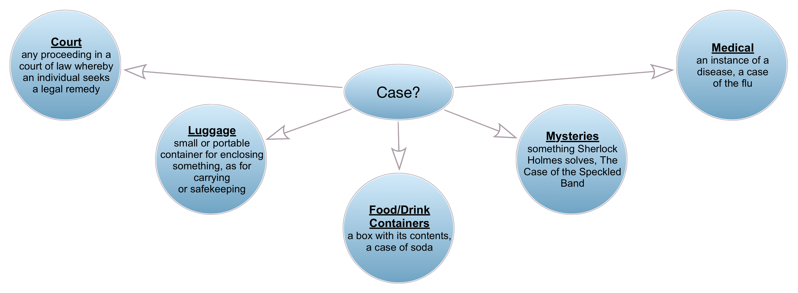

# Main NIEM 6 Training Document

# Introduction

## Purpose

Deliver a NIEM 101 course for executives and project managers as well as a techical course focused on preparing developers and implementers to use NIEM.

## Supporting Documents

All materials are available on the NIEM Training Github repo at [https://github.com/niemopen/niem-open-training](https://github.com/niemopen/niem-open-training). Specific materials used are listed on the README page and include:

- **Main NIEM Training Document**
	- [Main NIEM Training Document (XML)](https://github.com/niemopen/niem-open-training/blob/main/Main%20NIEM%20XML%20Training%20Document.md)
	- [Main NIEM Training Document (JSON)](https://github.com/niemopen/niem-open-training/blob/main/Main%20NIEM%20JSON%20Training%20Document.md)
- [Individual module documents](https://github.com/niemopen/niem-open-training/tree/main/Modules)
- [Mapping Spreadsheets](https://github.com/niemopen/niem-open-training/tree/main/Mapping_Spreadsheets)
- [Ersatz Textual Instances](https://github.com/niemopen/niem-open-training/tree/main/Text_Document)

## Sample Message Specification

- [Crash Driver Message Specification](https://github.com/niemopen/niem-open-training/tree/main/Crash%20Driver%20IEPD)

## Agenda

- Logistics
- Introduction to NIEM
- Introduction to Message Spec / IEPD Development
	- Scenario Planning
	- Requirements Analysis
	- Mapping
		- Intro to Mapping
			- Mapping to Existing Objects
		- Creating New Objects
		- External Standards
	- Creating and Validating Schemas
	- Assembly
	- Publishing
	- Implementation
- Resources
___
## Logistics and Background

- Major revamp of prior training programs
- Updated for NIEM 6
- Send questions to info@niemopen.org
- This document and supporting materials are at:
	- https://github.com/niemopen/niem-open-training/
___
## Introduction to NIEM

- What is NIEM?
- The Scope of NIEM
- NIEM Harmonization and Organization
- NIEMOpen and OASIS Open Projects
___
### What is NIEM? - Framework
- NIEM is a community-driven, government and jurisdiction-wide, standards-based approach to exchanging information
- Diverse communities can collectively leverage NIEM to increase efficiencies and improve decision-making
- NIEM is available to everyone, including public and private organizations
- NIEM includes a data model, governance, training, tools, technical support services, and an active community to assist users in adopting a standards-based approach to exchanging data


___
### What is NIEM? – Interop Problem
- If we don’t understand what each other means, we won’t be able to exchange info
- Need a common language for defining things


___
### What is NIEM? And what it's not?
**NIEM is:**
- a common vocabulary
- a means of enabling efficient information exchange across diverse public and private organizations

**NIEM is not:**
- a system or database
- a means of specifying how to transmit or store data
___
### What is NIEM? – Exchanging Data and Components
- Using NIEM, organizations come together to agree on a common vocabulary
- When additional organizations are added to the information exchange, the initial NIEM exchange can be reused, saving time and money


___
### What is NIEM? – Simplified Exchanges
- When using NIEM, you only need to “speak” two languages: your own and NIEM

| Without NIEM | With NIEM |
| --- | --- |
|||
___
### Scope of NIEM
- NIEM is a data layer standard and intentionally does not address all the necessary technologies needed for information sharing
- Exchange partners decide how to store and process the NIEM-conformant data being exchanged


___
### Scope of NIEM - Open Source Interconnection (OSI) model

**Detailed:**


**Simplified:**


___
### Bottle of Liquid
**A bottle of liquid:**

|  |  |
| --- | --- |
| Has some combination of liquids inside | NIEM is the liquid inside, the payload document |
| Has a shape | NIEM doesn’t care about the shape |
| Made of certain materials | NIEM doesn’t care about what the bottle is made out of or how it's constructed |
| Can be opaque or transparent | NIEM doesn’t care about whether you can see into the bottle |
| Is moved around by various means | NIEM doesn’t care about how you move the bottle around |
| Can be filled and emptied | NIEM doesn’t care about how you filled it or what you do with the liquid later |

___
### NIEM Harmonization and Organization

- Think of the NIEM data model as a mature and stable data dictionary of agreed-upon terms, definitions, relationships, and formats independent of how information is stored in individual agency systems
- The data model consists of two sets of closely related vocabularies:
	- NIEM core
	- Individual NIEM domains
- NIEM core includes data elements commonly agreed upon across all NIEM domains (i.e., person, activity, location, and item, etc.)
- Individual NIEM domains contain mission-specific data components that build upon NIEM core concepts


| Existing Domains                              | Upcoming Domains             |
| --------------------------------------------- | ---------------------------- |
| Agriculture                                   | International Human Services |
| Biometrics                                    |                              |
| Chemical, Biological, Radiological, & Nuclear |                              |
| Cyber                                         |                              |
| Emergency Management                          |                              |
| Human Services                                |                              |
| Immigration                                   |                              |
| Infrastructure Protection                     |                              |
| Intelligence                                  |                              |
| International Trade                           |                              |
| Justice                                       |                              |
| Learning and Development                      |                              |
| Maritime                                      |                              |
| Military Operations                           |                              |
| Screening                                     |                              |
| Surface Transportation                        |                              |

**Domains hold objects specific to their domains:**

| Agriculture | Biometrics |
| --- | --- |
|  |  |

| Chemical, Biological, Radiological, & Nuclear | Emergency Management |
| --- | --- |
|  |  |

| Human Services | Immigration |
| --- | --- |
|  |  |

| Infrastructure Protection | Intelligence |
| --- | --- |
|  |  |

| International Trade | Justice |
| --- | --- |
|  |  |

| Maritime | Military Operations |
| --- | --- |
|  |  |

| Screening  | Surface Transportation |
| --- | --- |
|  |  |


**NIEM Versioning**

- NIEM has major and minor versions, plus domain updates
- Major version releases, e.g. 5.2 to 6.0
	- Every 3 years
	- All bets are off
	- NIEM-Core can and will change
		- Underlying infrastructure can also change
	- Domains can change
	- Domains are harmonized
		- Combination of tools and human collaboration to reach consensus
		- Repeated content is collapsed
		- Misplaced content is moved, either to other domains or to core
		- New content is added
	- _Nothing_ in a major version change is guaranteed to be backwards compatible with earlier major releases
	- NIEM 6.0 schemas out now, support documentation mid-2025
- Minor version releases, e.g. 5.1 to 5.2:
	- Annually
	- **NIEM-Core does not change!**
		- **Neither does the underlying infrastructure**
	- Domains can change
	- Domains can be harmonized
	- Domains can be added, like Cyber in 5.1
	- Domains are not guaranteed to be backwards compatible with earlier minor releases
		- But they often are
	- NIEM 6.1 is planned
- Domain updates are done per-domain
	- Domains can update their content in between minor releases
	- Those updates then are normally folded into the next minor release
- Older versions never go away
	- You can still use NIEM 1.0 (but shouldn't)
	- There are plenty of NIEM 2.0 exchanges in current use
- Migration
	- Don't have to migrate
	- May want to migrate if a newer version gives you functionality you need (and you're already making changes)
	- NIEM provides tools for migrating the NIEM objects, ~90% effective
	- Manual work is needed for things you've added for your exchange

**NIEM Administration and Organization**

Overall structure is always changing, but this is a simplifed snapshot at the time of recording.

- Project Governing Board (PGB)
- NIEM Business Architecture Committee (NBAC)
- NIEM Technical Architecture Committee (NTAC)


### NIEMOpen and OASIS Open Projects

**Move to OASIS**

The NIEM program has transitioned from being a solely government-funded project to an open source project under [OASIS Open](https://www.oasis-open.org). So here's a quick plug for OASIS Open...

**About OASIS Open**

One of the most respected, nonprofit open source and open standards bodies in the world, OASIS Open advances the fair, transparent development of open source software and standards through the power of global collaboration and community.

**Why Should My Organization Join the NIEM OASIS Open Project?**

- Participate in the development of internationally recognized NIEM standards, ensuring your perspectives and use-cases are represented
- Unify fragmented efforts and encourage convergence
- Facilitate communication between private and public-sector
- Create partnerships and tap into brain trust of NIEM experts from the public sector
- Opportunity to become a steward with a seat on the NIEM Board
- Determine if/when approved work should be submitted to ITU, ICC, UN, ISO, etc.

**Get Involved!**

- Involvement is free!
- Decision-making powers require paid sponsorship
	- Sliding scale for different types of organizations

For more information about supporting the NIEM OASIS Open Project, contact info@niemopen.org.
___# Message Spec / IEPD Overview

- Old Name: "Information Exchange Package Documentation (IEPD)"
- New Name: "Message Specification"
- Defines an exchange
- Made up of a bunch of documents, "artifacts"
	- Some meant for humans
	- Some meant for computers
___

## Message Spec Process

Creating a Message Spec is a multi-step process:

1. Scenario Planning
2. Analyze Requirements
3. Map and Model
4. Build and Validate
5. Assemble and Document (and Publish) 
6. Implement


Each step produces artifacts used by subsequent steps:

1. A clue as to what you're doing...
2. UML Diagrams
3. Mapping Spreadsheet
4. Schemas and Instance Documents
5. Textual Documents
6. Code


**Message Spec / IEPD Process – Idealized**


**Message Spec / IEPD Process – Real Life**


___

### Message Spec / IEPD Artifacts - Documentation

- Master Documentation (Word)
- Message Spec / IEPD catalog document (`iepd-catalog.xml`)
- Change log (text)
- README (text)
- Conformance assertion (text)
- Mapping Spreadsheet
___

### Message Spec / IEPD Artifacts - Definitional

- Wantlist (`wantlist.xml`)
- Schema subset schemas
- Extension schemas
- Exchange schemas
- Sample instances
- XML catalogs
___
## Scenario Planning

- Decide what the exchange is about
- Who are the exchange partners?
- Who are stakeholders?
- Communication is key


- Existing exchanges or other documentation can help
	- Within your organization
	- From NIEM repositories
		- https://www.niem.gov/about-niem/message-exchange-package-mep-registry-repository
	- There's a community to draw from


___
### Existing Documentation

- Current technical architecture documents of all exchange partners
- Stakeholders that will be involved in the exchange
- Security, privacy, and other policy-related concerns associated with the exchange
- Technical characteristics of the exchange:
	- Types of data being shared
	- Number of data objects
		- Current structure of the data (logical, physical)
		- Use of external standards
___
## Analyze Requirements
- Diagrams
	- Use Case Diagrams
	- Business Process Diagrams
	- Sequence Diagrams
- Class Diagrams
- Spreadsheets
- Other documents

**Use Case Diagrams**


**Business Process Diagrams**


**Sequence Diagrams**


___
### UML Class Diagrams

- The bread and butter of Message Spec / IEPD business requirements
- Can be oriented towards business terms and objects
	- Better for consensus
- Can be oriented towards NIEM terms and objects
	- Pre-loads the mapping step
___
### Business Oriented Class Diagram

Representing objects in UML by their business names and relationships.


This vary depending on how your subject matter experts view objects and their relationships. For example, the charge to person relationship could be charge to the driver instead. Cardinality, which we will touch on later, could vary depending on the needs of the exchange. The important thing is reflecting how your business folks understand the data, not model purity.
___
### NIEM Oriented Class Diagram


___
### UML Tools
- [ArgoUML](https://en.wikipedia.org/wiki/ArgoUML)
- [BOUML](https://en.wikipedia.org/wiki/BOUML)
- [MagicDraw](https://en.wikipedia.org/wiki/MagicDraw) / [Rational Rose](https://en.wikipedia.org/wiki/IBM_Rational_Rose_XDE) (\$\$\$)
- [Visio](https://en.wikipedia.org/wiki/Microsoft_Visio) / [OmniGraffle](https://en.wikipedia.org/wiki/OmniGraffle)
- [Graphviz](https://graphviz.org/) / [Mermaid](https://mermaid-js.github.io/mermaid/) / [PlantUML](https://plantuml.com/)
- Many more…
___
### Business Rules
- Some rules are _not_ easily represented in UML
- You can use whatever works for your needs
- Schematron for XML
	- e.g. Birth dates must be in the past, salutations matching gender
- Plain old textual descriptions are great!
___

### The Process from Here On…

We have choices on how to proceed:

- Step-by-step
	- Finish mapping entirely before starting schemas
- Concurrent
	- Building schemas and instances as you go
- We'll use something in-between
	- Build an ersatz matching instance document as we map ([Crash Driver Report Complete](/Text_Document/12_Crash_Driver_Report_Complete.md))
	- Sorta like YAML without data values
	- Save schemas for the end## JSON Schema in a Nutshell

JSON Schema defines what an JSON document needs to look like. (XML Schema does the same for XML documents.)

For example, this bit of JSON Schema defines what a `PersonName` object needs to look like.

```json
"nc:PersonNameType": {
	"description": "A data type for a combination of names and/or titles by which a person is known.",
	"type": "object",
	"properties": {
		"nc:PersonGivenName": {"type": "string"},
		"nc:PersonMiddleName": {
			"type": "array",
			"items": {"type": "string"}
		},
		"nc:PersonSurName": {"type": "string"},
		"nc:personNameCommentText": {"type": "string"}
	},
	"required": ["nc:PersonSurName"]
}
```


```json
"nc:PersonName": {
	"description": "A combination of names and/or titles by which a person is known.",
	"type": "array",
	"items": {"$ref": "#/definitions/nc:PersonNameType"}
}
```
And here's what the matching JSON _instance_ document might look like.

```json
"nc:PersonName": [
	{
		"nc:PersonGivenName": "Peter",
		"nc:PersonMiddleName": [
			"Death",
			"Bredon"
		],
		"nc:PersonSurName": "Wimsey"
	}
]
```


## Map and Model

For this entire mapping process, we'll look at various things in the mapping spreadsheet and show how to map them to NIEM or to new elements that we'll create later. As we move through, we'll cover all the major aspects of how NIEM works.
___
### Introduction to Mapping

- Mapping Spreadsheets Options
	- NIEM Mapping Template
	- Custom Spreadsheet
- Mapping Process
	- Document Business Objects
	- Map them to NIEM objects, existing or new
	- While maintaining an Ongoing Sample Instance Skeleton
___
### NIEM Mapping Template

- Primarily for submitting content for inclusion in NIEM
	- Eight different tabs
- Can also be used for mapping in a Message Spec / IEPD
	- Just need a few of the tabs, mainly Property and Type
- Is a bit overkill for a Message Spec
- Slight difference between the versions on the NIEM site and for use with MEP Builder
- [Mapping Spreadsheet Template](/Mapping_Spreadsheets/niem-mapping-template.xlsx)
___
### Custom Mapping Spreadsheet

- Has evolved over time
- Contains all the info needed to make schemas
- Not as overwhelming as the NIEM Mapping Template
- You can make your own custom one
	- The Message Spec / IEPD Spec doesn’t specify a required format, by design
- Fresh copy for our example Message Spec / IEPD
	- [Mapping Spreadsheet (Numbers)](/Mapping_Spreadsheets/00_Crash_Driver_Report_Fresh.numbers)
	- [Mapping Spreadsheet (Excel)](/Mapping_Spreadsheets/00_Crash_Driver_Report_Fresh.xlsx)
	- [Mapping Spreadsheet (PDF)](/Mapping_Spreadsheets/00_Crash_Driver_Report_Fresh.pdf)

___
### Basics of Searching NIEM

**Tools**

- [SSGT](https://tools.niem.gov/niemtools/ssgt/index.iepd) (will be replaced with NIEM Toolbox)
- [Wayfarer](http://niem5.org/wayfarer/) (will be replace with API-driven Wayfarer)
- NIEM Schemas
	- [Official Releases](https://niem.github.io/niem-releases/)
	- [Schemas as HTML](https://niemopen.github.io/niem-open-training/)
- Spreadsheet (included in the official releases)

**Techniques**

- Search for Terms
	- Simple vs Advanced
- Search for Synonyms
- Search for Word Roots
- Search for Containers
- Search for Properties

___
# Mapping and NIEM Technical Details

NIEM can be used with JSON via [JSON-LD](https://en.wikipedia.org/wiki/JSON-LD). JSON-LD extends JSON to allow for meaningfully linking data together. NIEM leverages JSON-LD in two ways:

1. NIEM uses `@context` to provide a mapping from JSON object names back to their counterparts in NIEM
2. NIEM uses `@id` and `@uri` to provide links between JSON objects

Linking is a topic for later in the class, but here is an example of the `@context`. This context tells us that `nc:Person` refers to the `Person` object in the NIEM-Core namespace.

```json
"@context": {
	"nc": "http://release.niem.gov/niem/niem-core/5.0/",
	"xs": "http://www.w3.org/2001/XMLSchema"
}
```

The structure of the JSON instances mirrors the structure of the XML instances, although the schemas for each may look quite different, as JSON Schema and XML Schema work quite differently.

JSON-LD and JSON Schema are separate concepts. NIEM does not _yet_ support JSON Schema as a canonical definition of NIEM, but tools support making JSON Schema subsets against which to validate your instances. Links to schemas will go to the XML Schema versions due to this.

## Understanding NIEM Objects

- JSON Schema uses properties and definitions, similar to XML Schema's elements and types
	- We'll call them "elements" and "types"
- What a property/element can hold is based on its definition/type
- What you are (your type) defines what you can hold


### JSON Schema

The JSON Schema defining [`nc:Person`](https://niemopen.github.io/niem-open-training/nc.html#Person) includes a definition of the property and a "type".

Its type, [`nc:PersonType`](https://niemopen.github.io/niem-open-training/nc.html#PersonType), has a little more information. It includes a definition, one similar to `nc:Person`. It also includes a `type` of "object" and a list of objects that go _inside_ an `nc:Person` object. Each one is a reference to a declaration of each of those objects. JSON Schema cardinality is done via a combination of properties being listed as "required" and the "`type` of the element, whether the object holds one set of values or an array of values. Both are shown with `nc:Person` and `nc:PersonType`:

```json
"nc:PersonType": {
	"description": "A data type for a human being.",
	"type": "object",
	"properties": {
		"nc:PersonBirthDate": {"$ref": "#/properties/nc:PersonBirthDate"},
		"nc:PersonName": {"$ref": "#/properties/nc:PersonName"}
	},
	"required": ["nc:PersonName"]
}
```
```json
"nc:Person": {
	"description": "A human being.",
	"anyOf": [
		{
			"type": "array",
			"items": {"$ref": "#/definitions/nc:PersonType"}
		},
		{"$ref": "#/definitions/nc:PersonType"}
	]
}
```

The JSON Schema defining [`nc:PersonName`](https://niemopen.github.io/niem-open-training/nc.html#PersonName) and [`nc:PersonNameType`](https://niemopen.github.io/niem-open-training/nc.html#PersonNameType) looks like:

```json
"nc:PersonNameType": {
	"description": "A data type for a combination of names and/or titles by which a person is known.",
	"type": "object",
	"properties": {
		"nc:PersonGivenName": {"$ref": "#/properties/nc:PersonGivenName"},
		"nc:PersonMiddleName": {"$ref": "#/properties/nc:PersonMiddleName"},
		"nc:PersonSurName": {"$ref": "#/properties/nc:PersonSurName"},
		"nc:personNameCommentText": {"$ref": "#/properties/nc:personNameCommentText"}
	},
	"required": ["nc:PersonSurName"]
}
```
```json
"nc:PersonName": {
	"description": "A combination of names and/or titles by which a person is known.",
	"type": "array",
	"items": {"$ref": "#/definitions/nc:PersonNameType"}
}
```
The JSON Schema defining [`nc:PersonGivenName`](https://niemopen.github.io/niem-open-training/nc.html#PersonGivenName), [`PersonNameTextType`](https://niemopen.github.io/niem-open-training/nc.html#PersonNameTextType), and supporting types looks like:

```json
"nc:PersonNameTextType": {
	"description": "A data type for a name by which a person is known, referred, or addressed.",
	"$ref": "#/definitions/nc:ProperNameTextType"
},
"nc:ProperNameTextType": {
	"description": "A data type for a word or phrase by which a person or thing is known, referred, or addressed.",
	"$ref": "#/definitions/nc:TextType"
},
"nc:TextType": {
	"description": "A data type for a character string.",
	"type": "string"
}
```
```json
"nc:PersonGivenName": {
	"description": "A first name of a person.",
	"$ref": "#/definitions/nc:PersonNameTextType"
}
```
Finally, the definition for `nc:PersonBirthDate` is `nc:DateType` which holds a `nc:Date`:

```json
"nc:DateType": {
	"description": "A data type for a calendar date.",
	"type": "object",
	"properties": {
		"nc:Date": {"$ref": "#/properties/nc:Date"}
	},
	"required": ["nc:Date"]
}
```
```json
"nc:Date": {
	"description": "A full date.",
	"type": "string",
	"format": "date"
},
"nc:PersonBirthDate": {
	"description": "A date a person was born.",
	"$ref": "#/definitions/nc:DateType"
}
```

The resulting instance document that all this creates might look like this:

```json
"nc:Person": {
	"nc:PersonBirthDate": {"nc:Date": "1890-05-04"},
	"nc:PersonName": {
		"nc:PersonGivenName": "Peter",
		"nc:PersonMiddleName": [
			"Death",
			"Bredon"
		],
		"nc:PersonSurName": "Wimsey"
	}
}
```

(Who is [Peter Wimsey](https://en.wikipedia.org/wiki/Lord_Peter_Wimsey)?)
___

## Native Properties


- Some things will be easy to find
- Will map directly to NIEM objects
- Examples:
	- `nc:Person`, `nc:PersonName`, `nc:PersonGivenName`, etc.
	- Search for `nc:Person` in the [SSGT](http://niem5.org/ssgt_redirect.php?query=person)
	- Search for `nc:Person` in [Wayfarer](http://niem5.org/wayfarer/search.php?option=exact&query=person)

We've already seen the schema for these in detail.

### Artifacts

- [Native Properties](/Text_Document/01_Native_Properties.md)
- Mapping Spreadsheets
	- [Mapping Spreadsheet (Numbers)](/Mapping_Spreadsheets/01_Native_Properties.numbers)
	- [Mapping Spreadsheet (Excel)](/Mapping_Spreadsheets/01_Native_Properties.xlsx)
	- [Mapping Spreadsheet (PDF)](/Mapping_Spreadsheets/01_Native_Properties.pdf)

___
## Substitution Groups


- Some concepts can be represented multiple ways
- Text / code combinations are common
- Date can be a date, datetime, or a range
- NIEM uses substitution groups to support both:
	- The single concept, and
	- Multiple representations of that concept
- Examples:
	- `nc:PersonBirthDate` ([SSGT](https://tools.niem.gov/niemtools/ssgt/SSGT-GetProperty.iepd?propertyKey=o4-11r)/[Wayfarer](http://niem5.org/wayfarer/nc/PersonBirthDate.html)) contains a `nc:DateRepresentation` ([SSGT](https://tools.niem.gov/niemtools/ssgt/SSGT-GetProperty.iepd?propertyKey=o4-92a)/[Wayfarer](http://niem5.org/wayfarer/nc/DateRepresentation.html))
	- Substitution group heads follow the form of: `SomethingRepresentation` or `WhateverAbstract`

_However_, JSON Schema and JSON in general lack this concept of substitution groups. (So do most other serializations.) So in JSON Schema, `nc:Date` is directly inside of things of `nc:DateType`, with no substitution happening. This is one reason why NIEM transformations from XML to JSON are possible, but transformations the other direction are not. Transformations to JSON are _lossy_.

### Schemas

Here we see [`nc:PersonBirthDate`](https://niemopen.github.io/niem-open-training/nc.html#PersonBirthDate) and its type, `nc:DateType`:

```json
"nc:PersonBirthDate": {
	"description": "A date a person was born.",
	"$ref": "#/definitions/nc:DateType"
}
```
Unlike in XML, [`nc:DateType`](https://niemopen.github.io/niem-open-training/nc.html#DateType) contains `nc:Date`directly:

```json
"nc:DateType": {
	"description": "A data type for a calendar date.",
	"type": "object",
	"properties": {
		"nc:Date": {"$ref": "#/properties/nc:Date"}
	},
	"required": ["nc:Date"]
}
```


### Instance Documents

The matching JSON similarly just shows `nc:Date`:

```json
"nc:Person": {
	"nc:PersonBirthDate": {
		"nc:Date": "1890-05-04"
	},
	"nc:PersonName": {
		"nc:PersonGivenName": "Peter",
		"nc:PersonMiddleName": [
			"Death",
			"Bredon"
		],
		"nc:PersonSurName": "Wimsey"
	}
}
```

### Artifacts

- [Substitition Groups](/Text_Document/02_Substitution_Groups.md)
- Mapping Spreadsheets
	- [Mapping Spreadsheet (Numbers)](/Mapping_Spreadsheets/02_Substitution_Groups.numbers)
	- [Mapping Spreadsheet (Excel)](/Mapping_Spreadsheets/02_Substitution_Groups.xlsx)
	- [Mapping Spreadsheet (PDF)](/Mapping_Spreadsheets/02_Substitution_Groups.pdf)

___
## An Aside about Namespaces

In our examples, you've seen objects with different prefixes, like `j:Crash` and `nc:ActivityDate`. The `j` and `nc` refer to different namespaces in JSON-LD.

- Namespaces organize elements by context
- Identified by prefix, a nickname for the namespace
- NIEM governance is organized along these lines



JSON-LD maps JSON objects to NIEM namespaces in the `@context` object. Each of these entries maps a prefix to a NIEM namespace, providing a link back to the NIEM object. 

```json
"@context": {
	"ext": "http://training.niem.gov/CrashDriver/1.0/extension#",
	"j": "https://docs.oasis-open.org/niemopen/ns/model/domains/justice/6.0/#",
	"nc": "https://docs.oasis-open.org/niemopen/ns/model/niem-core/6.0/#"
}
```

The `@context` object does _not_ have to be included in every exchange. It's enough that it exists _somewhere_.

In an XML context, NIEM namespaces are mapped to individual files. Each XML Schema file defines a single namespace. In JSON, these can all be kept in a single JSON Schema file.
___


- NIEM is a model, not a flat data dictionary
- Some concepts don’t exist as elements using the terms for the concept
- Instead, properties are "inherited"
	- Scare quotes because JSON Schema doesn't really support inheritance
	- Instead, you combine groups of elements
	- End result is similar
- There is no “Crash Date” in NIEM ([SSGT](http://niem5.org/ssgt_redirect.php?query=crash+date)/[Wayfarer](http://niem5.org/wayfarer/search.php?option=both&query=crash+date))
- There _is_ an `ActivityDate` which can be inside a `Crash` object ([SSGT](https://tools.niem.gov/niemtools/ssgt/SSGT-GetProperty.iepd?propertyKey=o4-44f)/[Wayfarer](http://niem5.org/wayfarer/j/Crash.html))

### Schemas

Here's [`j:Crash`](https://niemopen.github.io/niem-open-training/j.html#Crash) and its type, `j:CrashType`:

```json
"j:Crash": {
	"description": "A traffic accident.",
	"$ref": "#/definitions/j:CrashType"
}
```

[`j:CrashType`](https://niemopen.github.io/niem-open-training/j.html#CrashType) contains several things, but the important thing here is what it's based on, `j:DrivingIncidentType`:

```json
"j:CrashType": {
	"description": "A data type for a traffic accident.",
	"allOf": [
		{"$ref": "#/definitions/j:DrivingIncidentType"},
		{
			"type": "object",
			"properties": {
				"j:CrashVehicle": {"$ref": "#/properties/j:CrashVehicle"},
				"j:CrashPerson": {"$ref": "#/properties/j:CrashPerson"},
				"nc:Location": {"$ref": "#/properties/nc:Location"}
			},
			"required": [
				"j:CrashVehicle",
				"nc:Location"
			]
		}
	]
}
```

[`j:DrivingIncidentType`](https://niemopen.github.io/niem-open-training/j.html#DrivingIncidentType) is, in turn, based on an even more generic type, `nc:IncidentType`:

```json
"j:DrivingIncidentType": {
	"description": "A data type for details of an incident involving a vehicle.",
	"$ref": "#/definitions/nc:IncidentType"
}
```

[`nc:IncidentType`](https://niemopen.github.io/niem-open-training/nc.html#IncidentType) is, also in turn, based on a very generic type, `nc:ActivityType`:

```json
"nc:IncidentType": {
	"description": "A data type for an occurrence or an event that may require a response.",
	"$ref": "#/definitions/nc:ActivityType"
}
```

And we finally get to [`nc:ActivityType`](https://niemopen.github.io/niem-open-training/nc.html#ActivityType), which contains [`nc:ActivityDate`](https://niemopen.github.io/niem-open-training/nc.html#ActivityDate):

```json
"nc:ActivityType": {
	"description": "A data type for a single or set of related actions, events, or process steps.",
	"type": "object",
	"properties": {
		"nc:ActivityDate": {"$ref": "#/properties/nc:ActivityDate"}
	},
	"required": ["nc:ActivityDate"]
}
```
If you're coming from an XML perspective to JSON Schema, it's important to realize that this isn't true inheritance from an object oriented perspective, although it functions identically in most situations.

What this all means is that a `j:Crash` object can contain a `nc:ActivityDate`, which is, contextually, a Crash Date.

### Instance Documents

Instance in JSON:

```json
"j:Crash": {
	"nc:ActivityDate": {
		"nc:Date": "1900-05-04"
	}
}
```

You need to understand this concept in order to know to look for these cases, which are very common, but just use tools to figure out the details, e.g:

- [`j:Crash` in the SSGT](https://tools.niem.gov/niemtools/ssgt/SSGT-GetProperty.iepd?propertyKey=o4-44f)
- [`j:Crash` in Wayfarer](http://niem5.org/wayfarer/j/Crash.html)
	- Wayfarer has a new feature that does some level of [contextual searching](http://niem5.org/wayfarer/searchcontextuals.php)
	- [Search contextually for "crash date" in Wayfarer](http://niem5.org/wayfarer/searchcontextuals.php?query=crash+date)

### Artifacts

- [Inherited Properties](Text_Document/03_Inherited_Properties.md)
- Mapping Spreadsheets
	- [Mapping Spreadsheet (Numbers)](Mapping_Spreadsheets/03_Inherited_Properties.numbers)
	- [Mapping Spreadsheet (Excel)](Mapping_Spreadsheets/03_Inherited_Properties.xlsx)
	- [Mapping Spreadsheet (PDF)](Mapping_Spreadsheets/03_Inherited_Properties.pdf)

___
## Linking Things Together

- NIEM is relational in many senses
- Objects can refer to each other across an XML hierarchy
- Allows NIEM to represent real world, many-to-many relationships
- `structures` namespace provides the infrastructure to make this work

### NIEM Structural "Layers"

NIEM has several conceptual layers which build on top of each other:

- `structures` provides infrastructure
	- All namespaces draw from it
- `niem-core` provides common objects to be used or built upon
	- Domains draw from it
- Domains provide domain-specific content, often built from `niem-core`
	- Domains can draw from each other, although this is limited in practice
- Code table namespaces define many of the code tables, built with infrastructure from `structures`
	- Domains draw from it for code definitions
- Wrappers for external standards, built with infrastructure from `structures`


## Referencing - JSON-LD

JSON itself doesn't provide a means of linking objects together. NIEM leverages [JSON-LD](https://en.wikipedia.org/wiki/JSON-LD) to provide that functionality. We've seen earlier how the `@context` section provides a mapping from a JSON instance back to NIEM object. NIEM also uses `@id` objects to both mark objects with an ID as well as refer to IDs applied to other objects.

Again, we will see example throughout the next few sections.

```json
"Cat": {
	"CatName": "Jett",	
	"CatOwner": {
		"@id": "#owner01"
	}
},
"Human": {
	"@id": "#owner01",
	"HumanName": "Tom"
}
```
___
## Associations


- Relationships can be complex
- NIEM provides powerful Association objects
- Trade-off can be implementation complexity
- Associations link objects together
	- Associations reference the associated objects
	- Can link to multiple objects
	- Can thus form many-to-many relationships between them
- Associations also hold information about the association itself
	- `Date` or `DateRange` is a common example
- Associations can also just include the things being associated, if desired
- Examples:
	- `j:PersonChargeAssociation` ([SSGT](https://tools.niem.gov/niemtools/ssgt/SSGT-GetProperty.iepd?propertyKey=o4-4qf)/[Wayfarer](http://niem5.org/wayfarer/j/PersonChargeAssociation.html))
	- Anything ending in “Association” ([SSGT](http://niem5.org/ssgt_redirect.php?query=association)/[Wayfarer](http://niem5.org/wayfarer/search.php?option=names&query=association))

### Schemas

[`j:PersonChargeAssociation`](https://niemopen.github.io/niem-open-training/j.html#PersonChargeAssociation) is used, as the name suggests, to link together a Person and a Charge. It's of `j:PersonChargeAssociationType`:

```json
"j:PersonChargeAssociation": {
	"description": "An association between a person and a charge issued to that person.",
	"type": "array",
	"items": {"$ref": "#/definitions/j:PersonChargeAssociationType"}
}
```

[`j:PersonChargeAssociationType`](https://niemopen.github.io/niem-open-training/j.html#PersonChargeAssociationType) includes a [`nc:Person`](https://niemopen.github.io/niem-open-training/nc.html#Person) and a [`j:Charge`](https://niemopen.github.io/niem-open-training/j.html#Charge), but also includes information _about_ the association itself, in this case [`j:JuvenileAsAdultIndicator`](https://niemopen.github.io/niem-open-training/j.html#JuvenileAsAdultIndicator). (Which isn't used in _this_ exchange.) `PersonChargeAssociationType` extends `nc:AssociationType`:

```json
"j:PersonChargeAssociationType": {
	"description": "A data type for an association between a person and a charge.",
	"allOf": [
		{"$ref": "#/definitions/nc:AssociationType"},
		{
			"type": "object",
			"properties": {
				"nc:Person": {"$ref": "#/properties/nc:Person"},
				"j:Charge": {"$ref": "#/properties/j:Charge"},
				"j:JuvenileAsAdultIndicator": {"$ref": "#/properties/j:JuvenileAsAdultIndicator"}
			},
			"required": [
				"nc:Person",
				"j:Charge"
			]
		}
	]
}
```
[`nc:AssociationType`](https://niemopen.github.io/niem-open-training/nc.html#AssociationType) adds in generic association information like a start and end date and a description. Remember that these are inherited by any type based on `nc:AssociationType`, so things of `j:PersonChargeAssociationType` automatically get these common objects.

```json
"nc:AssociationType": {
	"description": "A data type for an association, connection, relationship, or involvement somehow linking people, things, and/or activities together."
}
```

### Instance Documents

In the instance document, the association object can specify the objects being associated together by pointing to then with `@id` attributes, or by including the object inside the association object.

First, here's the association using referencing. The applicable `nc:Person` and `j:Charge` objects are external to `j:PersonChargeAssociation`. While shown next to the `j:PersonChargeAssociation` object, they could be _anywhere_ in the instance document.

This method is useful when the same `nc:Person` object is being used in multiple contexts. In the example Message Spec / IEPD, this `nc:Person` is also the `j:CrashDriver` and the `j:CrashPerson`. This method allows us to define the `nc:Person` once and refer to it multiple times.

This beings with it two advantages:

1. This `nc:Person` object is not being replicated; there is no duplication of data
2. We know that the `nc:Person` in the Association _and_ the `j:CrashDriver` _and_ the `j:CrashPerson` are the exact same person, and not three people with the same name

```json
"j:PersonChargeAssociation": {
	"nc:Person": {
		"@id": "#P01"
	},
	"j:Charge": {
		"@id": "#CH01"
	},
},
"nc:Person": {
	"@id": "#P01",
	"nc:PersonName": {
		"nc:PersonGivenName": "Peter"
	}
},
"j:Charge": {
	"@id": "#CH01",
	"j:ChargeDescriptionText": "Furious Driving",
	"j:ChargeFelonyIndicator": false
}
```


The disadvantage with using referencing is that it can be more difficult to implement. Implementations need to look for matching `@id` attributes.

The alternative to referencing is to just include the `nc:Person` and `j:Charge` information inside the association:

```json
"j:PersonChargeAssociation": {
	"nc:Person": {
		"nc:PersonName": {
			"nc:PersonGivenName": "Peter"
		}
	},
	"j:Charge": {
		"j:ChargeDescriptionText": "Furious Driving",
		"j:ChargeFelonyIndicator": false
	}
}

```

You can also mix and match. You could reference a `nc:Person` while including the `j:Charge` inside the association.

NIEM _never_ requires you to do referencing. If the trade-offs of duplicated data aren't an issue, you can have multiple identical `nc:Person` objects.

JSON-LD works similarly. `j:PersonChargeAssociation` contains a `nc:Person` object with an `@id`. `j:Charge` is the same. These IDs match the `@id` objects in the actual `nc:Person` and `j:Charge` object outside the association:


As with the XML version, you can also just include the `nc:Person` and `j:Charge` objects inside the association:


The same trade-offs apply as in XML, but JSON developers may lean more towards inclusion rather than referencing based on implementation effort required. Again, NIEM _never_ requires you to do referencing.

Additionally, while referencing is part of XML Schema, it is _not_ part of JSON Schema. Checking that the `@id` values match up needs to be done with a JSON-LD validator.

### Artifacts

- [Associations](/Text_Document/04_Associations.md)
- Mapping Spreadsheets
	- [Mapping Spreadsheet (Numbers)](/Mapping_Spreadsheets/04_Associations.numbers)
	- [Mapping Spreadsheet (Excel)](/Mapping_Spreadsheets/04_Associations.xlsx)
	- [Mapping Spreadsheet (PDF)](/Mapping_Spreadsheets/04_Associations.pdf)

___
## Roles


- Modeling some objects as specialized things gets complicated
- Roles are roles that objects play
	- People, organizations, items are the major ones
- Roles and objects playing the roles are linked together using the `uri` attribute
	- An object can play multiple roles, because multiple role objects can have the same `uri` value
- Roles contain other information about the role
- Roles are _not_ explicitly defined as such
- Examples:
	- `j:CrashPerson` ([SSGT](https://tools.niem.gov/niemtools/ssgt/SSGT-GetProperty.iepd?propertyKey=o4-45q)/[Wayfarer](http://niem5.org/wayfarer/j/CrashPerson.html))
	- `j:CrashDriver`

### Searching for Injured Person

How do we find the match for "injured person"? Here's one way:

- Search for `injured person`
	- [SSGT](http://niem5.org/ssgt_redirect.php?query=injured+person)
	- [Wayfarer](http://niem5.org/wayfarer/search.php?option=both&query=injured+person)
- No results! How about `person injury`?
	- [SSGT](http://niem5.org/ssgt_redirect.php?query=person+injury)
	- [Wayfarer](http://niem5.org/wayfarer/search.php?option=both&query=person+injury)
- Notice that [`j:InjuryLocationCode`](http://niem5.org/wayfarer/j/InjuryLocationCode.html) looks like something an injured person would have
- That's inside of things of [`nc:InjuryType`](http://niem5.org/wayfarer/nc/InjuryType.html)
- [`j:CrashPersonInjury`](http://niem5.org/wayfarer/j/CrashPersonInjury.html) is one of the things of that type
- And that's inside of [`j:CrashPerson`](http://niem5.org/wayfarer/j/CrashPerson.html)


### Roles - Not Special Kinds of People

| Roles | Just a Guy |
| --- | --- |
|  |  |

### Roles – Allows an Object to Play Multiple Roles


### Roles - How They Work
Roles are linked to the Object playing the Role via the `uri` attribute:


Roles contain information about the Role:


### Schemas

[`j:CrashPerson`](https://niemopen.github.io/niem-open-training/j.html#CrashPerson) is of `j:CrashPersonType`:

```json
"j:CrashPerson": {
	"description": "A person involved in a traffic accident.",
	"type": "array",
	"items": {"$ref": "#/definitions/j:CrashPersonType"}
}
```

[`j:CrashPersonType`](https://niemopen.github.io/niem-open-training/j.html#CrashPersonType) contains information specific to this role. In the sample Message Spec / IEPD, we're also using `j:CrashPersonInjury`:

```json
"j:CrashPersonType": {
	"description": "A data type for any person involved in a traffic accident.",
	"type": "object",
	"properties": {
		"j:CrashPersonInjury": {"$ref": "#/properties/j:CrashPersonInjury"},
		"ext:PersonDefenestrationIndicator": {"$ref": "#/properties/ext:PersonDefenestrationIndicator"}
	}
}
```

### Instance Documents

JSON-LD is used to link the role to the object playing the role. Here the `j:CrashPerson` object has a `@uri` that matches the one in the `nc:Person` object:

```json
"j:CrashPerson": {
	"@uri": "http://some.uri/",
	"j:CrashPersonInjury": {
		"nc:InjuryDescriptionText" : "Broken Arm"
	}
},

"nc:Person": {
	"@uri": "http://some.uri/",
	"nc:PersonName": {
		"nc:PersonGivenName": "Peter"
	}
}
```

### Artifacts

- [Roles](/Text_Document/05_Roles.md)
- Mapping Spreadsheets
	- [Mapping Spreadsheet (Numbers)](/Mapping_Spreadsheets/05_Roles.numbers)
	- [Mapping Spreadsheet (Excel)](/Mapping_Spreadsheets/05_Roles.xlsx)
	- [Mapping Spreadsheet (PDF)](/Mapping_Spreadsheets/05_Roles.pdf)

___
## Code Tables


- Codes help ensure accurate information
- Codes are, essentially, strings, simple data
- A few in NIEM are integers
- Elements defined in the domains
- Types are often defined in their own namespaces
- Examples:
	- `j:InjurySeverityCode` ([SSGT](https://tools.niem.gov/niemtools/ssgt/SSGT-GetProperty.iepd?propertyKey=o4-45s)/[Wayfarer](http://niem5.org/wayfarer/j/InjurySeverityCode.html))
		- In the SSGT, the actual codes are viewable on the page for the base simple type, e.g. [`aamva_d20:AccidentSeverityCodeSimpleType`](https://tools.niem.gov/niemtools/ssgt/SSGT-GetType.iepd?typeKey=o4-c)
		- In Wayfarer, there should be a link on the element page bringing up the codes in a separate window, e.g. [`aamva_d20:AccidentSeverityCodeSimpleType`](http://niem5.org/wayfarer/aamva_d20/AccidentSeverityCodeSimpleType_codes.html)
	- Anything ending in "Code" ([SSGT](http://niem5.org/ssgt_redirect.php?query=code)/[Wayfarer](http://niem5.org/wayfarer/search.php?option=names&query=code))
- Codes nearly always have a text alternative

### Schemas

[`j:InjurySeverityCode`](https://niemopen.github.io/niem-open-training/j.html#InjurySeverityCode) is a code table, with its codes defined in another namespace, the one for [AAMVA](https://www.aamva.org/). Here's the schema for the element:

```json
"j:InjurySeverityCode": {
	"description": "A severity of an injury received by a person, such as in a traffic accident or crash.",
	"$ref": "#/definitions/aamva_d20:AccidentSeverityCodeType"
}
```

The actual codes are defined in  [`aamva_d20:AccidentSeverityCodeType`](https://niemopen.github.io/niem-open-training/aamva_d20.html#AccidentSeverityCodeType), as a `oneOf` construct listing one code per `const` below:

```json
"aamva_d20:AccidentSeverityCodeType": {
	"description": "A data type for severity levels of an accident.",
	"type": "string",
	"oneOf": [
		{
			"const": "1",
			"description": "Fatal Accident"
		},
		{
			"const": "2",
			"description": "Incapacitating Injury Accident"
		},
		{
			"const": "3",
			"description": "Non-incapacitating Evident Injury"
		},
		{
			"const": "4",
			"description": "Possible Injury Accident"
		},
		{
			"const": "5",
			"description": "Non-injury Accident"
		},
		{
			"const": "9",
			"description": "Unknown"
		}
	]
}
```
### Instance Documents

The code is what shows up in the instance document. The longer definition does not. If you want to know that "3" means "Non-incapacitating Evident Injury," you need to refer to the schema. JSON Schema validation _will_ verify that the value is one of the enumerated `const` values: 

```json
"j:CrashPersonInjury": {
	"nc:InjuryDescriptionText": "Broken Arm",
	"j:InjurySeverityCode": "3"
}
```

### Artifacts

- [Code Tables](/Text_Document/06_Code_Tables.md)
- Mapping Spreadsheets
	- [Mapping Spreadsheet (Numbers)](/Mapping_Spreadsheets/06_Code_Tables.numbers)
	- [Mapping Spreadsheet (Excel)](/Mapping_Spreadsheets/06_Code_Tables.xlsx)
	- [Mapping Spreadsheet (PDF)](/Mapping_Spreadsheets/06_Code_Tables.pdf)

___
## Combining Domains (Augmentations)


- Sometimes you just want to add properties from other domains to an object without making a special kind of thing
- Augmentations are bags of stuff
- Augmentation Points are hooks onto which to hang the bags of stuff
- Examples:
	- `nc:Incident` ([SSGT](https://tools.niem.gov/niemtools/ssgt/SSGT-GetProperty.iepd?propertyKey=o4-rr))
	- `j:IncidentAugmentation` ([SSGT](https://tools.niem.gov/niemtools/ssgt/SSGT-GetProperty.iepd?propertyKey=o4-9l7))
- **Augmentations are an easy way to extend objects to meet your exchange needs**
	- We'll add an email address to a driver license using an augmentation we'll build
	- `j:DriverLicense` ([SSGT](https://tools.niem.gov/niemtools/ssgt/SSGT-GetProperty.iepd?propertyKey=o4-lb))
	- `j:DriverLicenseAugmentationPoint` ([SSGT](https://tools.niem.gov/niemtools/ssgt/SSGT-GetProperty.iepd?propertyKey=o4-11rg))

In XML, we would use substitution groups to add the augmentation to the exchange. _However_, JSON and JSON Schema lack this concept of substitution groups. (As do most other serializations.) So in JSON Schema, we will need to extend an existing type to hold the new information. This is one reason why NIEM transformations from XML to JSON are possible, but transformations the other direction are not. Transformations to JSON are _lossy_.

Our first step is to determine whether driver's license has what we need. Does it have an email address?

- Try searching for "drivers license":
	- [SSGT](http://niem5.org/ssgt_redirect.php?query=drivers+license)
	- [Wayfarer](http://niem5.org/wayfarer/search.php?option=both&query=drivers+license)
- Try searching for "driver license", singular:
	- [SSGT](http://niem5.org/ssgt_redirect.php?query=driver+license)
	- [Wayfarer](http://niem5.org/wayfarer/search.php?option=both&query=driver+license)
	- It's _usually_ a good idea to drop pluralization in search terms
- Check to see if it has an email address. (Spoiler, it doesn't.)
- But we should learn its structure while we're here:
	- Check what can contain it, specifically [`j:CrashDriver`](http://niem5.org/wayfarer/j/CrashDriver.html)
	- Follow up to [`j:CrashVehicle`](http://niem5.org/wayfarer/j/CrashVehicle.html)
	- Follow up to [`j:Crash`](http://niem5.org/wayfarer/j/Crash.html)

Follow a similar process for [`nc:ContactEmailID`](http://niem5.org/wayfarer/nc/ContactEmailID.html) and [`nc:ContactInformation`](http://niem5.org/wayfarer/nc/ContactInformation.html). Learn about the _object_, not just the individual elements.

The SSGT is best for learning overall structure, so check out [`j:Crash`](https://tools.niem.gov/niemtools/ssgt/SSGT-GetProperty.iepd?propertyKey=o4-44f) and [`nc:ContactInformation`](https://tools.niem.gov/niemtools/ssgt/SSGT-GetProperty.iepd?propertyKey=o4-eh) there, too!

(Why not [`j:CrashDriverLicense`](http://niem5.org/wayfarer/j/CrashDriverLicense.html)? It doesn't go inside a `j:CrashDriver`. Why? The domain submitted it like this. They'll review this for the next release.)

### Schemas

`j:DriverLicense` is defined to be of `j:DriverLicenseType`:

```json
"j:DriverLicense": {
	"description": "A license issued to a person granting driving privileges.",
	"$ref": "#/definitions/j:DriverLicenseType"
}
```

`j:DriverLicenseType` contains `j:DriverLicenseAugmentationPoint` as a hook for a augmentation bags, but this isn't usable in JSON due to the aforementioned XML-specific substitution groups:

```json
"j:DriverLicenseType": {
	"description": "A data type for a license issued to a person granting driving privileges.",
	"allOf": [
		{"$ref": "#/definitions/j:DriverLicenseBaseType"},
		{
			"type": "object",
			"properties": {
				"j:DriverLicenseCardIdentification": {"$ref": "#/properties/j:DriverLicenseCardIdentification"},
			},
			"required": ["j:DriverLicenseCardIdentification"]
		}
	]
}
```

While NIEM does have some augmentations pre-defined, they're particularly useful for adding new objects, or just putting existing NIEM objects somewhere else. Here we do the latter, creating a bag called `LicenseAugmentation` with `nc:ContactInformation` inside. 

`ext:` is the nickname we're going to use for our own extension namespace. This identifies our own objects apart from NIEM-supplied ones.

```json
"ext:LicenseAugmentationType": {
	"description": "A data type for additional information about a license.",
	"type": "object",
	"properties": {
		"nc:ContactInformation": {"$ref": "#/properties/nc:ContactInformation"}
	}
},

"ext:LicenseAugmentation": {
	"description": "Additional information about a license.",
	"$ref": "#/definitions/ext:LicenseAugmentationType"
}
```

Finally, we add it directly to `j:DriverLicenseType`. In XML, this would be done with a substitution, but those aren't available to JSON. XML would also put extensions like this into a separate file and namespace. In JSON, we just use one single schema document.

```json
"j:DriverLicenseType": {
	"description": "A data type for a license issued to a person granting driving privileges.",
	"allOf": [
		{"$ref": "#/definitions/j:DriverLicenseBaseType"},
		{
			"type": "object",
			"properties": {
				"j:DriverLicenseCardIdentification": {"$ref": "#/properties/j:DriverLicenseCardIdentification"},
				"ext:LicenseAugmentation": {"$ref": "#/properties/ext:LicenseAugmentation"}
			},
			"required": ["j:DriverLicenseCardIdentification"]
		}
	]
}
```

The resulting JSON instance looks like this:

```json
"j:DriverLicense": {
	"j:DriverLicenseCardIdentification": {
		"nc:IdentificationID": "A1234567"
	},
	"ext:LicenseAugmentation": {
		"nc:ContactInformation": {
			"nc:ContactEmailID": "peter@wimsey.org"
		}
	}
}
```

### Artifacts

- [Augmentations](/Text_Document/08_Combining_Domains_Augmentations.md)
- Mapping Spreadsheets
	- [Mapping Spreadsheet (Numbers)](/Mapping_Spreadsheets/08_Combining_Domains_Augmentations.numbers)
	- [Mapping Spreadsheet (Excel)](/Mapping_Spreadsheets/08_Combining_Domains_Augmentations.xlsx)
	- [Mapping Spreadsheet (PDF)](/Mapping_Spreadsheets/08_Combining_Domains_Augmentations.pdf)

___
## Metadata


Metadata is Data about Data. What does that mean? Here's an example:

### Data About Jett

- _Name:_ **Jett**
- _Sex:_ **Female**
- _Weight:_ **8 pounds**

### Data About Data About Jett, e.g. Her Weight

- _Reporting Organization:_ **Ark Pet Hospital**
- _Reported Date:_ **2021-06-10**
- _Last Verified Date:_ **2025-02-21**

### Object Reference Metadata

- Objects reference the metadata objects that apply to them
- An object can reference more than one metadata object
- More than one object can reference the same metadata object
- Example: `j:Metadata` (containing `j:CriminalInformationIndicator`) ([SSGT](https://tools.niem.gov/niemtools/ssgt/SSGT-GetProperty.iepd?propertyKey=o4-4qr)/[Wayfarer](http://niem5.org/wayfarer/j/Metadata.html))

### Connecting Metadata to Objects

| Connections | Diagram |
| --- | --- |
| Easy to apply multiple metadata objects to one object |  |
| Easy to apply same metadata to many objects |  |
| Many-to-many relationships can get messy |  |


### Schemas

The [`j:MetadataAugmentation`](https://niemopen.github.io/niem-open-training/j.html#MetadataAugmentation) object is of `j:MetadataAugmentationType`. 

```json
"j:MetadataAugmentation": {
	"description": "Information that further qualifies the kind of data represented.",
	"$ref": "#/definitions/j:Metadata## AugmentationType"
}
```

There's nothing special about [`j:MetadataAugmentationType`](https://niemopen.github.io/niem-open-training/j.html#MetadataAugmentationType). It's just defines an object holding some other objects, in this case a couple booleans indicators, `j:CriminalInformationIndicator` and `j:IntelligenceInformationIndicator`:

```json
"j:MetadataAugmentationType": {
	"description": "A data type for information that further qualifies the kind of data represented.",
	"type": "object",
	"properties": {
		"j:CriminalInformationIndicator": {"$ref": "#/properties/j:CriminalInformationIndicator"},
		"j:IntelligenceInformationIndicator": {"$ref": "#/properties/j:IntelligenceInformationIndicator"}
	}
}
```

There are multiple methods for creating metadata objects:

1. NIEM-supplied metadata objects can added to a subset and included in your exchange

```json
"j:MetadataAugmentation": {
	"description": "Information that further qualifies the kind of data represented.",
	"$ref": "#/definitions/j:MetadataAugmentationType"
}
```
```json
"j:MetadataAugmentationType": {
	"description": "A data type for information that further qualifies the kind of data represented.",
	"type": "object",
	"properties": {
		"j:CriminalInformationIndicator": {"$ref": "#/properties/j:CriminalInformationIndicator"},
		"j:IntelligenceInformationIndicator": {"$ref": "#/properties/j:IntelligenceInformationIndicator"}
	}
}
```

2. New metadata objects can be created in an extension as an augmentation or as a standalone object

```json
"ext:PrivacyMetadataType": {
	"description": "A data type for Additional information about Privacy.",
	"type": "object",
	"properties": {
		"ext:PrivacyCode": {"$ref": "#/properties/ext:PrivacyCode"}
	}
}
```

```json
"ext:PrivacyMetadata": {
	"description": "Metadata about Privacy.",
	"type": "array",
	"items": {"$ref": "#/definitions/ext:PrivacyMetadataType"}
}
```

```json
"ext:PrivacyCode": {
	"description": "A code representing a kind of property.",
	"type": "array",
	"items": {"$ref": "#/definitions/ext:PrivacyCodeType"},
	"maxItems": 2
}
```

### Instance Documents

There are also multiple methods to relate that metadata to objects in instance documents: 

1. Extend an object to include a metadata object

```json
"nc:InjuryType": {
	"description": "A data type for a form of harm or damage sustained by a person.",
	"type": "object",
	"properties": {
		"nc:InjuryDescriptionText": {"$ref": "#/properties/nc:InjuryDescriptionText"},
		"j:InjurySeverityCode": {"$ref": "#/properties/j:InjurySeverityCode"},
		"nc:InjurySeverityText": {"$ref": "#/properties/nc:InjurySeverityText"},
		"ext:PrivacyMetadata": {"$ref": "#/properties/ext:PrivacyMetadata"}
	},
}
```
Giving us an instance like this:

```json
"j:CrashPersonInjury": [
	{
		"nc:InjuryDescriptionText": "Broken Arm",
		"j:InjurySeverityCode": "3",
		"ext:PrivacyMetadata": [{
			"ext:PrivacyCode": [
				"PII",
				"MEDICAL"
			]
		}]
	}
]
```
2. Link metadata objects and the data objects to which they apply

```json
"j:Charge": {
	"@id": "#CH01",
	"j:ChargeDescriptionText": "Furious Driving",
	"j:ChargeFelonyIndicator": false
},
"j:Metadata": {
	"@id": "#CH01",
	"j:CriminalInformationIndicator": true,
	"j:IntelligenceInformationIndicator": false
}
```

### Artifacts

- [Metadata](/Text_Document/07_Metadata.md)
- Mapping Spreadsheets
	- [Mapping Spreadsheet (Numbers)](/Mapping_Spreadsheets/07_Metadata.numbers)
	- [Mapping Spreadsheet (Excel)](/Mapping_Spreadsheets/07_Metadata.xlsx)
	- [Mapping Spreadsheet (PDF)](/Mapping_Spreadsheets/07_Metadata.pdf)

___
## External Standards


- NIEM supports external standards, if they’re XML
- Wraps them in NIEM-conformant adapters
- Example:
	- NIEM: `nc:LocationGeospatialCoordinateAbstract` ([SSGT](https://tools.niem.gov/niemtools/ssgt/SSGT-GetProperty.iepd?propertyKey=o4-125z)/[Wayfarer](http://niem5.org/wayfarer/nc/LocationGeospatialCoordinateAbstract.html))
	- NIEM-conformant adapter: `geo:LocationGeospatialPoint` ([SSGT](https://tools.niem.gov/niemtools/ssgt/SSGT-GetProperty.iepd?propertyKey=o4-m73))
	- External standard: `gml:Point` ([SSGT](https://tools.niem.gov/niemtools/ssgt/SSGT-GetProperty.iepd?propertyKey=o4-fux))
- You’ll probably never use this, but should know it’s there
- SSGT supports them; Wayfarer does not

It doesn't make much sense to try and represent this in JSON in a NIEM-conformant way. NIEM doesn't (can't) provide rules for converting non-NIEM XML to JSON. This was auto-generated with an XML editor:

```json
"nc:Location": {
	"geo:LocationGeospatialPoint": {
		"gml:Point": {
			"gml:id": "point1",
			"gml:pos": {
				"srsName": "urn:ogc:def:crs:EPSG::4326",
				"srsDimension": 2,
				"#text": "40.689167 -74.044444"
			}
		}
	}
}
```

### Artifacts

- [External Standards](/Text_Document/09_External_Standards.md)
- Mapping Spreadsheets
	- [Mapping Spreadsheet (Numbers)](/Mapping_Spreadsheets/09_External_Standards.numbers)
	- [Mapping Spreadsheet (Excel)](/Mapping_Spreadsheets/09_External_Standards.xlsx)
	- [Mapping Spreadsheet (PDF)](/Mapping_Spreadsheets/09_External_Standards.pdf)

___
## Creating New Objects


___

### Creating Simple Data Elements


- Base them on whichever XML Schema data type is appropriate
	- They're all in the [niem-xs](https://niemopen.github.io/niem-open-training/niem-xs.html) schema
- Follow the flowchart for help
- Base on the `niem-xs` adapters if you need referencing
	- Folks generally do this anyway, for consistency
- Follow the naming format of existing NIEM elements of that type, especially regarding the last term, e.g. “Text”, “Code”, etc.

Create `PersonDefenestrationIndicator` using the existing NIEM type `niem-xs:boolean`:

```json
"ext:PersonDefenestrationIndicator": {
	"description": "True if this person was thrown through a window; false otherwise.",
	"type": "boolean"
}
```
Then we add it to `j:CrashPersonType` so that it can go inside of the `j:CrashPerson`:

```json
"j:CrashPersonType": {
	"description": "A data type for any person involved in a traffic accident.",
	"type": "object",
	"properties": {
		"nc:RoleOfPerson": {"$ref": "#/properties/nc:RoleOfPerson"},
		"j:CrashPersonInjury": {"$ref": "#/properties/j:CrashPersonInjury"},
		"ext:PersonDefenestrationIndicator": {"$ref": "#/properties/ext:PersonDefenestrationIndicator"}
	},
	"required": ["nc:RoleOfPerson"]
}
```


The resulting JSON is:

```json
"j:CrashPerson": {
	"nc:RoleOfPerson": {
	  "@id": "#P01"
	},
	"j:CrashPersonInjury": {
	  "nc:InjuryDescriptionText": "Broken Arm",
	  "j:InjurySeverityCode": "3",
	},
	"ext:PersonDefenestrationIndicator": "false"
}
```
Note the `@id` that links to an identical `@id` in the nc:Person object.

For a more complicated example, we can create the `ext:PrivacyCode` element along with a `ext:PrivacyMetadata` to hold it.

The actual codes are defined in `ext:PrivacyCodeSimpleType`. Each `const` defines a code. The `description` tags provide a longer text description of the code:

```json
"ext:PrivacyCodeType": {
	"description": "A data type for a code representing a kind of property.",
	"type": "string",
	"oneOf": [
		{
			"const": "PII",
			"description": "Personally Identifiable Information"
		},
		{
			"const": "MEDICAL",
			"description": "Medical Information"
		}
	]
}
```

Then `ext:PrivacyCode` is created to be of `ext:PrivacyCodeType`:

```json
"ext:PrivacyCode": {
	"description": "A code representing a kind of property.",
	"type": "array",
	"items": {"$ref": "#/definitions/ext:PrivacyCodeType"},
	"maxItems": 2
}
```

In this exchange, this code is metadata to be applied to other objects, so we can create `ext:PrivacyMetadata` and `ext:PrivacyMetadataType` to hold it:

```json
"ext:PrivacyMetadata": {
	"description": "Metadata about Privacy.",
	"type": "array",
	"items": {"$ref": "#/definitions/ext:PrivacyMetadataType"}
}
```
```json
"ext:PrivacyMetadataType": {
	"description": "A data type for metadata about Privacy.",
	"type": "object",
	"properties": {
		"ext:PrivacyCode": {"$ref": "#/properties/ext:PrivacyCode"}
	}
}
```

### Instance Documents

The resulting JSON instance document is:

```json
"j:CrashPerson": [
	{
		"nc:RoleOfPerson": {"@id": "#P01"},
		"j:CrashPersonInjury": [
			{
				"nc:InjuryDescriptionText": "Broken Arm",
				"j:InjurySeverityCode": "3",
				"ext:PrivacyMetadata": [
					{
						"ext:PrivacyCode": [
							"PII",
							"MEDICAL"
						]
					}
				]
			}
		],
		"ext:PersonDefenestrationIndicator": false
	}
]
```

Instead of linking to two separate metadata objects, we've embedded those into the `j:CrashPeson`. We could also have the `ext:PrivacyMetadata` object as a standalone object with an `@id` that we can link with other objects:

```json
"ext:PrivacyMetadata": [
	{
		"@id": "#PM01",
		"ext:PrivacyCode": ["PII"]
	}
]
```

### Artifacts

- [Creating New Objects - Simple Data](/Text_Document/10_Creating_New_Objects_Simple_Data.md)
- Mapping Spreadsheets
	- [Mapping Spreadsheet (Numbers)](/Mapping_Spreadsheets/10_Creating_New_Objects_Simple_Data.numbers)
	- [Mapping Spreadsheet (Excel)](/Mapping_Spreadsheets/10_Creating_New_Objects_Simple_Data.xlsx)
	- [Mapping Spreadsheet (PDF)](/Mapping_Spreadsheets/10_Creating_New_Objects_Simple_Data.pdf)

___
### Creating Complex Objects


- If you’re making a special kind of existing NIEM type:
	- Use that type as a base to extend from and add things to it, or
	- Create an Augmentation to hold your new things
- If you’re starting from scratch:
	- Use `structures:ObjectType` as a base to extend from and add things to it

Here we're making the root element that will hold everything else. We create `CrashDriverInfoType`, basing it on `structures:ObjectType` so that it's just an empty object.

To that empty object, we add all the major objects in our exchange, `nc:Person`, `j:Crash`, and `j:Charge`. We also add a `j:PersonChargeAssociation` which lets us link together people and charges. Finally, we add a couple metadata object, the built-in `j:Metadata`, and `ext:PrivacyMetadata`, which we create in the extension schema and is in the prior example.

```json
"ext:CrashDriverInfo": {
	"description": "A collection of information about the driver of a vehicle in a crash.",
	"anyOf": [
		{"$ref": "#/definitions/ext:CrashDriverInfoType"},
		{
			"type": "array",
			"items": {"$ref": "#/definitions/ext:CrashDriverInfoType"}
		}
	]
}
```
```json
"ext:CrashDriverInfoType": {
	"description": "A data type for a collection of information about the driver of a vehicle in a crash.",
	"type": "object",
	"properties": {
		"nc:Person": {"$ref": "#/properties/nc:Person"},
		"j:Crash": {"$ref": "#/properties/j:Crash"},
		"j:PersonChargeAssociation": {"$ref": "#/properties/j:PersonChargeAssociation"},
		"j:Charge": {"$ref": "#/properties/j:Charge"},
		"j:MetadataAugmentation": {"$ref": "#/properties/j:MetadataAugmentation"},
		"ext:PrivacyMetadata": {"$ref": "#/properties/ext:PrivacyMetadata"}
	},
	"required": [
		"nc:Person",
		"j:Crash"
	]
}
```

Another example is when we created `ext:LicenseAugmentation` and `ext:LicenseAugmentationType` when talking about augmentations.

### Adding New Content to the Exchange

To summarize, there are two major ways to add new content to an exchange. We've seen them both above.

If you're _already_ creating a new complex object and type, like `CrashDriverInfo` and `CrashDriverInfoType` above, you can simply add new elements to the new type, as we did with `ext:PrivacyMetadata`. 

But if you're not already creating the new type for other reasons, XML would use augmentations via substitution groups. However, JSON doesn't support substitution groups. That leaves us with two options:

1. Just add the new object to an existing NIEM type.
2. Make a new type extending an existing type, adding the new object to this new type. This is called "concrete extension."

In an XML context, NIEM schemas and user extension schemas are separate documents. You don't change the NIEM schemas directly to add new objects. That's where substitution groups are handy for extensions. But in a JSON context, it's all one big schema document. Changing NIEM types directly to add new elements makes the resulting JSON instance better match the equivalent XML instance.

The other option is concrete extensions. This is also done in an XML context, but not often as using augmentations via substitution groups is much cleaner. Concrete extensions are an option, but they come with a big drawback.

### Problems with Concrete Extensions

The issue with concrete extensions is that if the extension is happening deep inside an object, all the surrounding objects will also need to be extended. For example, if instead of adding `ext:LicenseAugmentation` directly to `j:DriverLicenseType` we extended `j:DriverLicenseType`, making a new `ext:DriverLicenseType` to hold our new object. Now we need a new element for it, `ext:DriverLicense`.

But `j:CrashDriver` doesn't hold an `ext:DriverLicense`, so we need to make a new `ext:CrashDriverType` and `ext:CrashDriver` that can hold an `ext:DriverLicense`.

But `j:CrashVehicle` doesn't hold a `ext:CrashDriver`, so we need to make a new `ext:CrashVehicleType` and `ext:CrashVehicle` that can hold an `ext:CrashDriver`.

But `j:Crash` doesn't hold an `ext:CrashVehicle`, so we need to make a new `ext:CrashType` and `ext:Crash` that can hold `ext:CrashVehicle`.

That's a lot of extra work and muddies the semantics of the elements.

### Artifacts

- [Creating New Objects - Complex Objects](/Text_Document/11_Creating_New_Objects_Complex_Objects.md)
- Mapping Spreadsheets
	- [Mapping Spreadsheet (Numbers)](/Mapping_Spreadsheets/11_Creating_New_Objects_Complex_Objects.numbers)
	- [Mapping Spreadsheet (Excel)](/Mapping_Spreadsheets/11_Creating_New_Objects_Complex_Objects.xlsx)
	- [Mapping Spreadsheet (PDF)](/Mapping_Spreadsheets/11_Creating_New_Objects_Complex_Objects.pdf)

___
## Mapping Completed!

- [Crash Driver Report Complete](/Text_Document/12_Crash_Driver_Report_Complete.md)
- Mapping Spreadsheets
	- [Mapping Spreadsheet (Numbers)](/Mapping_Spreadsheets/12_Crash_Driver_Report_Complete.numbers)
	- [Mapping Spreadsheet (Excel)](/Mapping_Spreadsheets/12_Crash_Driver_Report_Complete.xlsx)
	- [Mapping Spreadsheet (PDF)](/Mapping_Spreadsheets/12_Crash_Driver_Report_Complete.pdf)

| Started With | Ended With |
| --- | --- |
|  |  |

___


# Build and Validate

- Conformance
- Subsets
- Extension Schemas
- How things fit together

## NIEM Conformance

- Follow the rules in the [Naming and Design Rules (NDR)](http://niem.github.io/reference/specifications/ndr/) (NIEM 5)
	- Available in draft form for NIEM 6 on [Github](https://github.com/niemopen/niem-naming-design-rules/blob/dev/ndr6src.md)
- Follow the rules in the [IEPD Spec](http://niem.github.io/reference/specifications/iepd/) (NIEM 5)
	- Coming eventually for NIEM 6
- Many NDR rules exist as Schematron for XML
	- Can check these via the Conformance Testing Assistant (ConTesA) for NIEM 5
	- Can run the Schematron directly oXygen, with a plug-in in XMLSpy
		- See below
	- NIEM Toolbox will provide this functionality for NIEM 6 soon

## Schema Subsets

- NIEM has ~13,000 elements
- You don’t want them all
- NIEM supports mini versions of NIEM
	- With the elements / types you want
	- Plus things needed to make the elements / types you want work
- Use the [SSGT](https://tools.niem.gov/niemtools/ssgt/index.iepd) for this for NIEM 5
	- NIEM Toolbox will provide this functionality for NIEM 6 soon

## Extension Schema(s)

- Create new elements for your exchange
- Defines the root element of the exchange
- Emulate how NIEM does it, both in XML and in JSON
- Utilize Augmentations to add your new objects to existing NIEM objects in XML
	- Concrete extension is an alternative
	- Can directly modify NIEM objects in JSON in order to match XML instances
- Can have multiple extension schemas in XML
- Some folks put code tables into a separate extension schema in XML

## How Schemas Fit Together

### XML Schemas

In an XML context, NIEM is broken into domains, with one schema file per domain. This aids in governance as XML Schema is one of the canonical definitional formats for NIEM, so individual schema-based domains can be updated independently. It does make for a complicated diagram:


### JSON Schemas

JSON Schema is not one of the canonical definitional formats for NIEM. NIEM isn't maintained in a JSON Schema format. When you create a subset using JSON Schema, or convert XML or CMF to JSON Schema, everything will be in one schema file to which you can modify to add your extensions.

## Help with Schemas

- Use a good validating XML/JSON editor with schema support
	- XMLSpy
		- Windows
	- oXygen
		- Windows, macOS, Linux
- Declare a conformance target for XML
	- Just use the same one I am
- Declare and import all schemas used for XML
	- Watch out for schemas incorporated only via substitution groups
	- Group heads don’t know who the members are
	- Still need to declare and import those

## Example Instances

- Required
- Validating against your schemas ensures your intent
- Some editors can create them from schemas, but
	- You’ll always need to tweak those
- Other tools are out there…

## Tips and Tricks for XML

- Christina’s [oXygen Snippets](https://niem.github.io/reference/tools/oxygen/snippets/)
	- oXygen only
- Use [Schematron](https://niem.github.io/reference/tools/oxygen/ndr/) to check your work as you go
	- oXygen
	- XMLSpy with plug-in
- [MEP Builder](https://sourceforge.net/projects/niem-mep-builder/)
	- Work on mapping spreadsheets
	- Generate subsets

___


# Assemble and Document
- IEPD Catalog ([[iepd-catalog.xml]])
	- Metadata about the Message Spec / IEPD
	- What file is what
	- What the root element is
- Readme ([[Crash Driver IEPD/README|README]])
- Changelog ([[changelog]])
- Conformance Assertion ([[conformance]])
- Mapping Spreadsheet
- Main Documentation

## Main Documentation
- Just a Word document
	- Or another document format, e.g. Markdown, PDF, etc.
- A NIEM Message Spec / IEPD master document should (at a minimum) describe:
	- Message Spec / IEPD purpose
	- Scope
	- Business value
	- Exchange information
	- Senders/receivers
	- Interactions
	- References to other documentation, if applicable
- Don’t paste schemas into them!

## Message Spec / IEPD Assembly
- Message Specs / IEPDs are just ZIP files full of artifacts
- Can organize how you like
	- The IEPD Catalog is the guide to your organization
	- Generally, keep it simple
- MEP Builder can help with this
___
# Publishing

## NIEM Repos

- NIEM used to have a problem with existing repositories being out of date
	- IEPD Clearinghouse (old material)
	- Work With IEPDs (currently not working)
- New repository is here!
	- [Message Exchange Package (MEP) Registry & Repository](https://www.niem.gov/about-niem/message-exchange-package-mep-registry-repository)
	- Has all the archival material from the old Clearinghouse
	- Has all the material from "Work With IEPDs"
	- Has new material as well

## Other Websites

- Other entities can list their own
	- Example: [ACF](https://acf.gov/completed-information-exchange-packet-documentation-iepd)

___


# Implementation

- Remember that NIEM is just the payload
	- It’s just plain old XML
		- Well, okay, with referencing
	- Or it’s just plain JSON
		- Well, okay, with JSON-LD
- Remember the scope of NIEM
	- Things outside the payload aren't NIEM
	- You don’t have to do anything special for NIEM outside NIEM’s scope

## Skill level to Implement NIEM
- Developers with the skills to design and implement a data exchange can learn the NIEM approach in a matter of hours
- Developer training is available
- Plenty of example IEPDs to follow
	- New repository!
- Don’t start from scratch, leverage shared IEPDs
- The NIEM technical specifications are complex, however
	- Most developers do not need to read them
	- Free tools can perform most of the conformance checking
		- Schematron directly
		- [Conformance Testing Assistant (ConTesA)](https://tools.niem.gov/contesa/)
		- NIEM Toolbox is coming for NIEM 6!

___
# Resources

## Documentation

- Prior NIEM Releases
	- [http://niem.github.io/niem-releases/](http://niem.github.io/niem-releases/)
- Current NIEM Specifications
	- [https://github.com/niemopen#specifications/](https://github.com/niemopen#specifications/)
- Prior NIEM Specifications
	- [http://niem.github.io/reference/specifications/](http://niem.github.io/reference/specifications/)
- Materials from this course:
	- [https://github.com/niemopen/niem-open-training/](https://github.com/niemopen/niem-open-training/)
- NIEMOpen.org Contact Page
	- [https://www.niemopen.org/contact](https://niemopen.org/contact/)

## Tools

- NIEM Toolbox
	- [https://niemopen.github.io/niem-toolbox/](https://niemopen.github.io/niem-toolbox/)
- SSGT:
	- [https://tools.niem.gov/niemtools/ssgt/index.iepd](https://tools.niem.gov/niemtools/ssgt/index.iepd)
- Conformance Testing Assistant (ConTesA)
	- [https://tools.niem.gov/contesa/](https://tools.niem.gov/contesa/)
- NDR Schematron
	- [https://niem.github.io/reference/tools/oxygen/ndr/](https://niem.github.io/reference/tools/oxygen/ndr/)
- MEP Builder
	- [https://mep.niemopen.org/]((https://mep.niemopen.org/)/)
- Wayfarer:
	- [http://niem5.org/wayfarer/](http://niem5.org/wayfarer/)
- oXygen Snippets
	- [https://niem.github.io/reference/tools/oxygen/snippets/](https://niem.github.io/reference/tools/oxygen/snippets/)

## Repositories

- Message Exchange Package (MEP) Registry & Repository
	- https://www.niem.gov/about-niem/message-exchange-package-mep-registry-repository

___
Generated on: 
Wed Sep 10 15:00:30 UTC 2025
