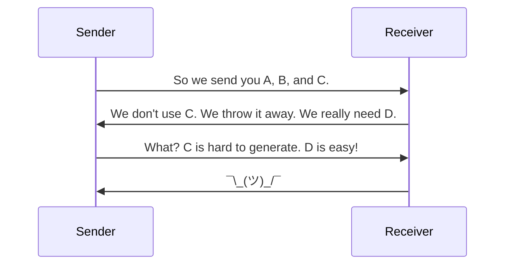

# Main NIEM Training Document
NIEM Training

Tom Carlson, GTRI
Thomas.Carlson@gtri.gatech.edu

# Introduction

## Purpose

A technical webinar focused on developers and implementers who are interested in a deep-dive of NIEM.

## Supporting Documents

All materials are available on the NIEM Training Github repo at [https://github.com/niemopen/niem-open-training](https://github.com/niemopen/niem-open-training). Specific materials used are listed on the README page and include:

- **Master NIEM Training Document**
	- [Master NIEM Training Document (XML)](https://github.com/niemopen/niem-open-training/blob/main/Main%20NIEM%20XML%20Training%20Document.md)
	- [Master NIEM Training Document (JSON)](https://github.com/niemopen/niem-open-training/blob/main/Main%20NIEM%20JSON%20Training%20Document.md)
- [Mapping Spreadsheets](https://github.com/niemopen/niem-open-training/tree/main/Mapping_Spreadsheets)
- [Ersatz Textual Instances](https://github.com/niemopen/niem-open-training/tree/main/Text_Document)

## Sample Message Specification

- [Crash Driver Message Specification](https://github.com/niemopen/niem-open-training/tree/main/Crash%20Driver%20IEPD)

## Agenda

- Logistics
- Introduction to NIEM
- Introduction to Message Spec / IEPD Development
	- Scenario Planning
	- Requirements Analysis
	- Mapping
		- Intro to Mapping
			- Mapping to Existing Objects
		- Creating New Objects
		- External Standards
	- Creating and Validating Schemas
	- Assembly
	- Publishing
	- Implementation
- Exercises
- Resources
___
## Logistics and Background

- Major revamp of prior training programs
- Three days, 1-5pm each day
- Short breaks on the hour
- Ask questions via chat _when you have them_
	- Someone is monitoring chat and will interrupt me as needed
- This document and supporting materials are at:
	- https://github.com/niemopen/niem-open-training/
___
## Introduction to NIEM

- What is NIEM?
- The Scope of NIEM
- NIEM Harmonization and Organization
___
### What is NIEM? - Framework
- NIEM is a community-driven, government and jurisdiction-wide, standards-based approach to exchanging information
- Diverse communities can collectively leverage NIEM to increase efficiencies and improve decision-making
- NIEM is available to everyone, including public and private organizations
- NIEM includes a data model, governance, training, tools, technical support services, and an active community to assist users in adopting a standards-based approach to exchanging data


___
### What is NIEM? – Interop Problem
- If we don’t understand what each other means, we won’t be able to exchange info
- Need a common language for defining things


___
### What is NIEM? And what not?
**NIEM is:**
- a common vocabulary
- a means of enabling efficient information exchange across diverse public and private organizations

**NIEM is not:**
- a system or database
- a means of specifying how to transmit or store data
___
### What is NIEM? – Exchanging Data and Components
- Using NIEM, organizations come together to agree on a common vocabulary
- When additional organizations are added to the information exchange, the initial NIEM exchange can be reused, saving time and money


___
### What is NIEM? – Simplified Exchanges
- When using NIEM, you only need to “speak” two languages: your own and NIEM

| Without NIEM | With NIEM |
| --- | --- |
|||
___
### Scope of NIEM
- NIEM is a data layer standard and intentionally does not address all the necessary technologies needed for information sharing
- Exchange partners decide how to store and process the NIEM-conformant data being exchanged


___
### Scope of NIEM - Open Source Interconnection (OSI) model

**Detailed:**


**Simplified:**


___
### Bottle of Liquid
**A bottle of liquid:**

|  |  |
| --- | --- |
| Has some combination of liquids inside | NIEM is the liquid inside, the payload document |
| Has a shape | NIEM doesn’t care about the shape |
| Made of certain materials | NIEM doesn’t care about what the bottle is made out of or how it's constructed |
| Can be opaque or transparent | NIEM doesn’t care about whether you can see into the bottle |
| Is moved around by various means | NIEM doesn’t care about how you move the bottle around |
| Can be filled and emptied | NIEM doesn’t care about how you filled it or what you do with the liquid later |

___
### NIEM Harmonization and Organization

- Think of the NIEM data model as a mature and stable data dictionary of agreed-upon terms, definitions, relationships, and formats independent of how information is stored in individual agency systems
- The data model consists of two sets of closely related vocabularies:
	- NIEM core
	- Individual NIEM domains
- NIEM core includes data elements commonly agreed upon across all NIEM domains (i.e., person, activity, location, and item, etc.)
- Individual NIEM domains contain mission-specific data components that build upon NIEM core concepts


| Existing Domains                              | Upcoming Domains             |
| --------------------------------------------- | ---------------------------- |
| Agriculture                                   | International Human Services |
| Biometrics                                    |                              |
| Chemical, Biological, Radiological, & Nuclear |                              |
| Cyber                                         |                              |
| Emergency Management                          |                              |
| Human Services                                |                              |
| Immigration                                   |                              |
| Infrastructure Protection                     |                              |
| Intelligence                                  |                              |
| International Trade                           |                              |
| Justice                                       |                              |
| Learning and Development                      |                              |
| Maritime                                      |                              |
| Military Operations                           |                              |
| Screening                                     |                              |
| Surface Transportation                        |                              |

**Domains hold objects specific to their domains:**

| Agriculture | Biometrics |
| --- | --- |
|  |  |

| Chemical, Biological, Radiological, & Nuclear | Emergency Management |
| --- | --- |
|  |  |

| Human Services | Immigration |
| --- | --- |
|  |  |

| Infrastructure Protection | Intelligence |
| --- | --- |
|  |  |

| International Trade | Justice |
| --- | --- |
|  |  |

| Maritime | Military Operations |
| --- | --- |
|  |  |

| Screening  | Surface Transportation |
| --- | --- |
|  |  |


**NIEM Versioning**

- NIEM has major and minor versions, plus domain updates
- Major version releases, e.g. 5.2 to 6.0
	- Every 3 years
	- All bets are off
	- NIEM-Core can and will change
		- Underlying infrastructure can also change
	- Domains can change
	- Domains are harmonized
		- Combination of tools and human collaboration to reach consensus
		- Repeated content is collapsed
		- Misplaced content is moved, either to other domains or to core
		- New content is added
	- _Nothing_ in a major version change is guaranteed to be backwards compatible with earlier major releases
	- NIEM 6.0 schemas out now, support documentation mid-2025
- Minor version releases, e.g. 5.1 to 5.2:
	- Annually
	- **NIEM-Core does not change!**
		- **Neither does the underlying infrastructure**
	- Domains can change
	- Domains can be harmonized
	- Domains can be added, like Cyber in 5.1
	- Domains are not guaranteed to be backwards compatible with earlier minor releases
		- But they often are
	- NIEM 6.1 is planned
- Domain updates are done per-domain
	- Domains can update their content in between minor releases
	- Those updates then are normally folded into the next minor release
- Older versions never go away
	- You can still use NIEM 1.0 (but shouldn't)
	- There are plenty of NIEM 2.0 exchanges in current use
- Migration
	- Don't have to migrate
	- May want to migrate if a newer version gives you functionality you need (and you're already making changes)
	- NIEM provides tools for migrating the NIEM objects, ~90% effective
	- Manual work is needed for things you've added for your exchange

**NIEM Administration and Organization**


**Move to OASIS**

The NIEM program is transitioning from being a solely government-funded project to an open source project under [OASIS Open](https://www.oasis-open.org). So here's a quick plug for OASIS Open...

**About OASIS Open**

One of the most respected, nonprofit open source and open standards bodies in the world, OASIS Open advances the fair, transparent development of open source software and standards through the power of global collaboration and community.

**Why Should My Organization Join the NIEM OASIS Open Project?**

- Participate in the development of internationally recognized NIEM standards, ensuring your perspectives and use-cases are represented
- Unify fragmented efforts and encourage convergence
- Facilitate communication between private and public-sector
- Create partnerships and tap into brain trust of NIEM experts from the public sector
- Opportunity to become a steward with a seat on the NIEM Board
- Determine if/when approved work should be submitted to ITU, ICC, UN, ISO, etc.

**Get Involved!**

For more information about supporting the NIEM OASIS Open Project, contact TBD, TBD@oasis-open.org
___# Message Spec / IEPD Overview
- "Information Exchange Package Documentation"
- Slowly changing to "Message Specification"
- Defines an exchange
- Made up of a bunch of documents, "artifacts"
	- Some meant for humans
	- Some meant for computers
___
## Message Spec Process
Creating a Message Spec is a multi-step process:

1. Scenario Planning
2. Analyze Requirements
3. Map and Model
4. Build and Validate
5. Assemble and Document (and Publish) 
6. Implement


Each step produces artifacts used by subsequent steps:

1. A clue as to what you're doing...
2. UML Diagrams
3. Mapping Spreadsheet
4. Schemas and Instance Documents
5. Textual Documents
6. Code


**Message Spec / IEPD Process – Idealized**


**Message Spec / IEPD Process – Real Life**


___
### Message Spec / IEPD Artifacts - Documentation

- Master Documentation (Word)
- Message Spec / IEPD catalog document (`iepd-catalog.xml`)
- Change log (text)
- README (text)
- Conformance assertion (text)
- Mapping Spreadsheet

___
### Message Spec / IEPD Artifacts - Definitional

- Wantlist (`wantlist.xml`)
- Schema subset schemas
- Extension schemas
- Exchange schemas
- Sample instances
- XML catalogs
___
## Scenario Planning

- Decide what the exchange is about
- Who are the exchange partners?
- Who are stakeholders?
- Communication is key



- Existing exchanges or other documentation can help
	- Within your organization
	- From NIEM repositories (_huge caveat_)
	- There's a community to draw from


___
### Existing Documentation

- Current technical architecture documents of all exchange partners
- Stakeholders that will be involved in the exchange
- Security, privacy, and other policy-related concerns associated with the exchange
- Technical characteristics of the exchange:
	- Types of data being shared
	- Number of data objects
		- Current structure of the data (logical, physical)
		- Use of external standards
___
## Analyze Requirements
- Diagrams
	- Use Case Diagrams
	- Business Process Diagrams
	- Sequence Diagrams
- Class Diagrams
- Spreadsheets
- Other documents

**Use Case Diagrams**


**Business Process Diagrams**


**Sequence Diagrams**


___
### UML Class Diagrams

- The bread and butter of Message Spec / IEPD business requirements
- Can be oriented towards business terms and objects
	- Better for consensus
- Can be oriented towards NIEM terms and objects
	- Pre-loads the mapping step
___
### Business Oriented Class Diagram

Representing objects in UML by their business names and relationships.


This vary depending on how your subject matter experts view objects and their relationships. For example, the charge to person relationship could be charge to the driver instead. Cardinality, which we will touch on later, could vary depending on the needs of the exchange. The important thing is reflecting how your business folks understand the data, not model purity.
___
### NIEM Oriented Class Diagram


___
### UML Tools
- [ArgoUML](https://en.wikipedia.org/wiki/ArgoUML)
- [BOUML](https://en.wikipedia.org/wiki/BOUML)
- [MagicDraw](https://en.wikipedia.org/wiki/MagicDraw) / [Rational Rose](https://en.wikipedia.org/wiki/IBM_Rational_Rose_XDE) (\$\$\$)
- [Visio](https://en.wikipedia.org/wiki/Microsoft_Visio) / [OmniGraffle](https://en.wikipedia.org/wiki/OmniGraffle)
- [Graphviz](https://graphviz.org/) / [Mermaid](https://mermaid-js.github.io/mermaid/) / [PlantUML](https://plantuml.com/)
- Many more…
___
### Business Rules
- Some rules are _not_ easily represented in UML
- You can use whatever works for your needs
- Schematron for XML
	- e.g. Birth dates must be in the past, salutations matching gender
- Plain old textual descriptions are great!
___

### The Process from Here On…

We have choices on how to proceed:

- Step-by-step
	- Finish mapping entirely before starting schemas
- Concurrent
	- Building schemas and instances as you go
- We'll use something in-between
	- Build an ersatz matching instance document as we map ([Crash Driver Report Complete](/Text_Document/12_Crash_Driver_Report_Complete.md))
	- Sorta like YAML without data values
	- Save schemas for the end## XML Schema in a Nutshell

XML Schema defines what an XML document needs to look like. (JSON Schema does the same for JSON documents.)

For example, this bit of XML Schema defines what a `PersonName` object needs to look like.

```xml
<xs:complexType name="PersonNameType">
	<xs:annotation>
		<xs:documentation>A data type for a combination of names and/or titles by which a person is known.</xs:documentation>
	</xs:annotation>
	<xs:sequence>
		<xs:element name="PersonGivenName" type="xs:string" minOccurs="1" maxOccurs="1"/>
		<xs:element name="PersonMiddleName" type="xs:string" minOccurs="0" maxOccurs="unbounded"/>
		<xs:element name="PersonSurName" type="xs:string" minOccurs="1" maxOccurs="1"/>
	</xs:sequence>
	<xs:attribute name="personNameCommentText" type="xs:string" use="optional"/>
</xs:complexType>

<xs:element name="PersonName" type="PersonNameType" nillable="true">
	<xs:annotation>
		<xs:documentation>A combination of names and/or titles by which a person is known.</xs:documentation>
	</xs:annotation>
</xs:element>

```
And here's what the matching XML _instance_ document might look like.

```xml
<PersonName personNameCommentText="copied">
	<PersonGivenName>Peter</PersonGivenName>
	<PersonMiddleName>Bredon</PersonMiddleName>
	<PersonMiddleName>Death</PersonMiddleName>
	<PersonSurName>Wimsey</PersonSurName>
</PersonName>
```

We will see much more of this. This is just an initial glance at it.


## Map and Model
For this entire section, we'll look at various things in the mapping spreadsheet and show how to map them to NIEM or to new elements that we'll create later. As we move through, we'll cover all the major aspects of how NIEM works.
___
### Introduction to Mapping
- Mapping Spreadsheets Options
	- NIEM Mapping Template
	- Simple Training Spreadsheet
	- Something In-between
- Document Business Objects
- Map them to NIEM objects, existing or new
- Maintaining an Ongoing Sample Instance Skeleton
___
### NIEM Mapping Template
- Primarily for submitting content for inclusion in NIEM
	- Eight different tabs
- Can also be used for mapping in a Message Spec / IEPD
	- Just need a few of the tabs, mainly Property and Type
- Is a bit overkill for a Message Spec
- Slight difference between the versions on the NIEM site and for use with MEP Builder
- [Mapping Spreadsheet Template](/Mapping_Spreadsheets/niem-mapping-template.xlsx)
___
### Simple Training Spreadsheet
- Minimal
- Designed to be simple enough to fit on slides
	- No, really, that’s the constraint
- Usually expanded in practice


___
### Custom Mapping Spreadsheet
- Has evolved over time
- Contains all the info needed to make schemas
- Not as overwhelming as the NIEM Mapping Template
- You can make your own custom one
	- The IEPD Spec doesn’t specify a required format, by design
- Fresh copy for our example Message Spec / IEPD
	- [Mapping Spreadsheet (Numbers)](/Mapping_Spreadsheets/00_Crash_Driver_Report_Fresh.numbers)
	- [Mapping Spreadsheet (Excel)](/Mapping_Spreadsheets/00_Crash_Driver_Report_Fresh.xlsx)
	- [Mapping Spreadsheet (PDF)](/Mapping_Spreadsheets/00_Crash_Driver_Report_Fresh.pdf)
- Check on the cardinality
	- Why is Person 1..1?
	- Because this is a report on a Crash Driver, not the Crash itself
		- So the driver is the only person
		- Could simplify this Message Spec with some assumptions
		- But that would leave us with too little to do in class
	- A different context would have different cardinality
		- Likely multiple Person objects

___
### Basics of Searching NIEM

**Tools**

- [SSGT](https://tools.niem.gov/niemtools/ssgt/index.iepd) **replace with NIEM Toolbox**
- [Wayfarer](http://niem5.org/wayfarer/) **replace with API-driven Wayfarer
- NIEM Schemas
	- [Official Releases](https://niem.github.io/niem-releases/)
	- [HyperNIEM](http://niem5.org/schemas/) **replace with NIEM 6 HTML schemas at github.io**
- Spreadsheet (included in the official releases)

**Techniques**

- Search for Terms
	- Simple vs Advanced
- Search for Synonyms
- Search for Word Roots
- Search for Containers
- Search for Properties

___# Mapping and NIEM Technical Details

## Understanding NIEM Objects
- XML Schema uses elements and types
- What an element can hold is based on its type
- What you are (your type) defines what you can hold


### XML Schema

The XML Schema defining [`nc:Person`](http://niem5.org/schemas/nc.html#Person) includes a definition and a type.

Its type, [`nc:PersonType`](http://niem5.org/schemas/nc.html#PersonType), has a little more information. It also includes a definition, one similar to `nc:Person`. It also includes a `base` that tells us what sort of thing it is. In this case, the base is `structures:ObjectType`, which is just an empty object (that has a few infrastructure pieces we'll learn about later). To that `base` it adds several objects. These are objects that go _inside_ an `nc:Person` object. Each one is a reference to a declaration of each of those objects. Each also has cardinality defined, which tells us how many of each can go inside of an `nc:Person`. `minOccurs` is the minimum number of times. Any non-negative integer can go here, but 0 and 1 are what you'll usually find. Zero essentially means "optional." `maxOccurs` is the maximum number of times. This can also be any non-negative number, but can also be "unbounded", which means "as many as you want." Typical values are 1 and unbounded. Here's the schema for `nc:PersonType` with some of the contained objects removed for clarity:

```xml
<xs:complexType name="PersonType">
	<xs:annotation>
		<xs:documentation>A data type for a human being.</xs:documentation>
	</xs:annotation>
	<xs:complexContent>
		<xs:extension base="structures:ObjectType">
			<xs:sequence>
				<xs:element ref="nc:PersonAccentText" minOccurs="0" maxOccurs="unbounded"/>
				<xs:element ref="nc:PersonAgeDescriptionText" minOccurs="0" maxOccurs="unbounded"/>
				<!-- A whole slew of objects removed for clarity -->
				<xs:element ref="nc:PersonLivingIndicator" minOccurs="0" maxOccurs="unbounded"/>
				<!-- A whole slew of objects removed for clarity -->
				<xs:element ref="nc:PersonName" minOccurs="0" maxOccurs="unbounded"/>
				<!-- A whole slew of objects removed for clarity -->
				<xs:element ref="nc:PersonHomeContactInformation" minOccurs="0" maxOccurs="unbounded"/>
				<xs:element ref="nc:PersonAugmentationPoint" minOccurs="0" maxOccurs="unbounded"/>
			</xs:sequence>
		</xs:extension>
	</xs:complexContent>
</xs:complexType>

<xs:element name="Person" type="nc:PersonType" nillable="true">
	<xs:annotation>
		<xs:documentation>A human being.</xs:documentation>
	</xs:annotation>
</xs:element>

```

The XML Schema defining [`nc:PersonName`](http://niem5.org/schemas/nc.html#PersonName) and [`nc:PersonNameType`](http://niem5.org/schemas/nc.html#PersonNameType) looks like:

```xml
<xs:complexType name="PersonNameType">
	<xs:annotation>
		<xs:documentation>A data type for a combination of names and/or titles by which a person is known.</xs:documentation>
	</xs:annotation>
	<xs:complexContent>
		<xs:extension base="structures:ObjectType">
			<xs:sequence>
				<xs:element ref="nc:PersonNamePrefixAbstract" minOccurs="0" maxOccurs="unbounded"/>
				<xs:element ref="nc:PersonGivenName" minOccurs="0" maxOccurs="unbounded"/>
				<xs:element ref="nc:PersonMiddleName" minOccurs="0" maxOccurs="unbounded"/>
				<xs:element ref="nc:PersonSurName" minOccurs="0" maxOccurs="unbounded"/>
				<xs:element ref="nc:PersonNameSuffixText" minOccurs="0" maxOccurs="unbounded"/>
				<xs:element ref="nc:PersonMaidenName" minOccurs="0" maxOccurs="unbounded"/>
				<xs:element ref="nc:PersonFullName" minOccurs="0" maxOccurs="unbounded"/>
				<xs:element ref="nc:PersonNameCategoryAbstract" minOccurs="0" maxOccurs="unbounded"/>
				<xs:element ref="nc:PersonNameSalutationText" minOccurs="0" maxOccurs="unbounded"/>
				<xs:element ref="nc:PersonOfficialGivenName" minOccurs="0" maxOccurs="unbounded"/>
				<xs:element ref="nc:PersonPreferredName" minOccurs="0" maxOccurs="unbounded"/>
				<xs:element ref="nc:PersonSurNamePrefixText" minOccurs="0" maxOccurs="unbounded"/>
				<xs:element ref="nc:EffectiveDate" minOccurs="0" maxOccurs="unbounded"/>
				<xs:element ref="nc:PersonNameAugmentationPoint" minOccurs="0" maxOccurs="unbounded"/>
			</xs:sequence>
			<xs:attribute ref="nc:personNameCommentText" use="optional"/>
		</xs:extension>
	</xs:complexContent>
</xs:complexType>

<xs:element name="PersonName" type="nc:PersonNameType" nillable="true">
	<xs:annotation>
		<xs:documentation>A combination of names and/or titles by which a person is known.</xs:documentation>
	</xs:annotation>
</xs:element>

```

The XML Schema defining [`nc:PersonGivenName`](http://niem5.org/schemas/nc.html#PersonGivenName), [`PersonNameTextType`](http://niem5.org/schemas/nc.html#PersonNameTextType), and supporting types looks like:

```xml
<xs:complexType name="PersonNameTextType">
	<xs:annotation>
		<xs:documentation>A data type for a name by which a person is known, referred, or addressed.</xs:documentation>
	</xs:annotation>
	<xs:simpleContent>
		<xs:extension base="nc:ProperNameTextType">
			<xs:attribute ref="nc:personNameInitialIndicator" use="optional"/>
		</xs:extension>
	</xs:simpleContent>
</xs:complexType>

<xs:complexType name="ProperNameTextType">
	<xs:annotation>
		<xs:documentation>A data type for a word or phrase by which a person or thing is known, referred, or addressed.</xs:documentation>
	</xs:annotation>
	<xs:simpleContent>
		<xs:extension base="nc:TextType"/>
	</xs:simpleContent>
</xs:complexType>

<xs:complexType name="TextType">
	<xs:annotation>
		<xs:documentation>A data type for a character string.</xs:documentation>
	</xs:annotation>
	<xs:simpleContent>
		<xs:extension base="niem-xs:string">
			<xs:attribute ref="nc:partialIndicator" use="optional"/>
			<xs:attribute ref="nc:truncationIndicator" use="optional"/>
			<xs:attribute ref="xml:lang" use="optional"/>
		</xs:extension>
	</xs:simpleContent>
</xs:complexType>

<xs:element name="PersonGivenName" type="nc:PersonNameTextType" nillable="true">
	<xs:annotation>
		<xs:documentation>A first name of a person.</xs:documentation>
	</xs:annotation>
</xs:element>

```
Finally, the definition for `nc:PersonLivingIndicator` is very simple. It's a boolean value, `true` or `false`.

```xml
<xs:element name="PersonLivingIndicator" type="niem-xs:boolean" nillable="true">
	<xs:annotation>
		<xs:documentation>True if a person is alive; false if a person is dead.</xs:documentation>
	</xs:annotation>
</xs:element>
```

The resulting instance document that all this creates might look like this:

```xml
<nc:Person>
	<nc:PersonLivingIndicator>false</nc:PersonLivingIndicator>
	<nc:PersonName nc:personNameCommentText="copied">
		<nc:PersonGivenName>Peter</nc:PersonGivenName>
		<nc:PersonMiddleName>Death</nc:PersonMiddleName>
		<nc:PersonMiddleName>Bredon</nc:PersonMiddleName>
		<nc:PersonSurName>Wimsey</nc:PersonSurName>
	</nc:PersonName>
</nc:Person>
```

(Who is [Peter Wimsey](https://en.wikipedia.org/wiki/Lord_Peter_Wimsey)?)
___
## Native Properties


- Some things will be easy to find
- Will map directly to NIEM objects
- Examples:
	- `nc:Person`, `nc:PersonName`, `nc:PersonGivenName`, etc.
	- Search for `nc:Person` in the [SSGT](http://niem5.org/ssgt_redirect.php?query=person)
	- Search for `nc:Person` in [Wayfarer](http://niem5.org/wayfarer/search.php?option=exact&query=person)

We've already seen the schema for these in detail.

### Artifacts

- [Native Properties](/Text_Document/01_Native_Properties.md)
- Mapping Spreadsheets
	- [Mapping Spreadsheet (Numbers)](/Mapping_Spreadsheets/01_Native_Properties.numbers)
	- [Mapping Spreadsheet (Excel)](/Mapping_Spreadsheets/01_Native_Properties.xlsx)
	- [Mapping Spreadsheet (PDF)](/Mapping_Spreadsheets/01_Native_Properties.pdf)

___
## Substitution Groups


- Some concepts can be represented multiple ways
- Text / code combinations are common
- Date can be a date, datetime, or a range
- NIEM uses substitution groups to support both:
	- The single concept, and
	- Multiple representations of that concept
- Examples:
	- `nc:PersonBirthDate` ([SSGT](https://tools.niem.gov/niemtools/ssgt/SSGT-GetProperty.iepd?propertyKey=o4-11r)/[Wayfarer](http://niem5.org/wayfarer/nc/PersonBirthDate.html)) contains a `nc:DateRepresentation` ([SSGT](https://tools.niem.gov/niemtools/ssgt/SSGT-GetProperty.iepd?propertyKey=o4-92a)/[Wayfarer](http://niem5.org/wayfarer/nc/DateRepresentation.html))
	- Substitution group heads follow the form of: `SomethingRepresentation` or `WhateverAbstract`

### Schemas

Here we see [`nc:PersonBirthDate`](http://niem5.org/schemas/nc.html#PersonBirthDate) and its type, `nc:DateType`:

```xml
<xs:element name="PersonBirthDate" type="nc:DateType" nillable="true">
	<xs:annotation>
		<xs:documentation>A date a person was born.</xs:documentation>
	</xs:annotation>
</xs:element>
```

[`nc:DateType`](http://niem5.org/schemas/nc.html#DateType) contains `nc:DateRepresentation`, along with other date properties:

```xml
<xs:complexType name="DateType">
	<xs:annotation>
		<xs:documentation>A data type for a calendar date.</xs:documentation>
	</xs:annotation>
	<xs:complexContent>
		<xs:extension base="structures:ObjectType">
			<xs:sequence>
				<xs:element ref="nc:DateRepresentation" minOccurs="0" maxOccurs="unbounded"/>
				<xs:element ref="nc:DateAccuracyAbstract" minOccurs="0" maxOccurs="1"/>
				<xs:element ref="nc:DateMarginOfErrorDuration" minOccurs="0" maxOccurs="1"/>
				<xs:element ref="nc:DateAugmentationPoint" minOccurs="0" maxOccurs="unbounded"/>
			</xs:sequence>
		</xs:extension>
	</xs:complexContent>
</xs:complexType>
```
[`nc:DateRepresentation`](http://niem5.org/schemas/nc.html#DateRepresentation) is _abstract_, meaning it has no type and must be substituted with another object:

```xml
<xs:element name="DateRepresentation" abstract="true">
	<xs:annotation>
		<xs:documentation>A data concept for a representation of a date.</xs:documentation>
	</xs:annotation>
</xs:element>
```
Those other objects are identified by having a `substitutionGroup` attribute set to the name of the substitution group head. The most common one you'll see for `nc:DateRepresentation` is [`nc:Date`](http://niem5.org/schemas/nc.html#Date):

```xml
<xs:element name="Date" type="niem-xs:date" substitutionGroup="nc:DateRepresentation" nillable="true">
	<xs:annotation>
		<xs:documentation>A full date.</xs:documentation>
	</xs:annotation>
</xs:element>
```

### Instance Documents

In the resulting instance document, you don't see `nc:DateRepresentation` at all. You just see `nc:Date`, which is taking its place:

```xml
<nc:Person>
	<nc:PersonBirthDate>
		<nc:Date>1890-05-04</nc:Date>
	</nc:PersonBirthDate>
	<nc:PersonName>
		<nc:PersonGivenName>Peter</nc:PersonGivenName>
		<nc:PersonMiddleName>Death</nc:PersonMiddleName>
		<nc:PersonMiddleName>Bredon</nc:PersonMiddleName>
		<nc:PersonSurName>Wimsey</nc:PersonSurName>
	</nc:PersonName>
</nc:Person>
```
### Artifacts

- [Substitition Groups](/Text_Document/02_Substitution_Groups.md)
- Mapping Spreadsheets
	- [Mapping Spreadsheet (Numbers)](/Mapping_Spreadsheets/02_Substitution_Groups.numbers)
	- [Mapping Spreadsheet (Excel)](/Mapping_Spreadsheets/02_Substitution_Groups.xlsx)
	- [Mapping Spreadsheet (PDF)](/Mapping_Spreadsheets/02_Substitution_Groups.pdf)

___
## An Aside about Namespaces

Below you can see object with different prefixes, `j:Crash` and `nc:ActivityDate`. The `j` and `nc` refer to different namespaces in XML Schema.

- Namespaces organize elements by context
- Identified by prefix, a nickname for the namespace
- NIEM governance is organized along these lines


```xml
<xs:schema targetNamespace="http://training.niem.gov/CrashDriver/1.0/extension" version="1" xml:lang="en-US"  
    xmlns:ext="http://training.niem.gov/CrashDriver/1.0/extension"  
    xmlns:j="http://release.niem.gov/niem/domains/jxdm/7.0/"  
    xmlns:nc="http://release.niem.gov/niem/niem-core/5.0/">

    <xs:import schemaLocation="../niem/domains/jxdm.xsd"  
        namespace="http://release.niem.gov/niem/domains/jxdm/7.0/"/>
	<xs:import schemaLocation="../niem/niem-core.xsd"  
        namespace="http://release.niem.gov/niem/niem-core/5.0/"/>
```
___


- NIEM is a model, not a flat data dictionary
- Some concepts don’t exist as elements using the terms for the concept
- Instead, properties are inherited
- There is no “Crash Date” in NIEM ([SSGT](http://niem5.org/ssgt_redirect.php?query=crash+date)/[Wayfarer](http://niem5.org/wayfarer/search.php?option=both&query=crash+date))
- There _is_ an `ActivityDate` which can be inside a `Crash` object ([SSGT](https://tools.niem.gov/niemtools/ssgt/SSGT-GetProperty.iepd?propertyKey=o4-44f)/[Wayfarer](http://niem5.org/wayfarer/j/Crash.html))

### Schemas

Here's [`j:Crash`](http://niem5.org/schemas/j.html#Crash) and its type, `j:CrashType`:

```xml
<xs:element name="Crash" type="j:CrashType" nillable="true">
	<xs:annotation>
		<xs:documentation>A traffic accident.</xs:documentation>
	</xs:annotation>
</xs:element>
```
[`j:CrashType`](http://niem5.org/schemas/j.html#CrashType) contains several things, but the important thing here is what it's based on, `j:DrivingIncidentType`:

```xml
<xs:complexType name="CrashType">
	<xs:annotation>
		<xs:documentation>A data type for a traffic accident.</xs:documentation>
	</xs:annotation>
	<xs:complexContent>
		<xs:extension base="j:DrivingIncidentType">
			<xs:sequence>
				<xs:element ref="j:CrashServiceCall" minOccurs="0" maxOccurs="unbounded"/>
				<xs:element ref="j:CrashInformationSource" minOccurs="0" maxOccurs="unbounded"/>
				<!-- A whole slew of objects removed for clarity -->
				<xs:element ref="j:CrashAugmentationPoint" minOccurs="0" maxOccurs="unbounded"/>
			</xs:sequence>
		</xs:extension>
	</xs:complexContent>
</xs:complexType>
```

[`j:DrivingIncidentType`](http://niem5.org/schemas/j.html#DrivingIncidentType) is, in turn, based on an even more generic type, `nc:IncidentType`:

```xml
<xs:complexType name="DrivingIncidentType">
	<xs:annotation>
		<xs:documentation>A data type for details of an incident involving a vehicle.</xs:documentation>
	</xs:annotation>
	<xs:complexContent>
		<xs:extension base="nc:IncidentType">
			<xs:sequence>
				<xs:element ref="j:DrivingAccidentSeverityAbstract" minOccurs="0" maxOccurs="unbounded"/>
				<xs:element ref="j:DrivingIncidentCMVAbstract" minOccurs="0" maxOccurs="unbounded"/>
				<!-- A whole slew of objects removed for clarity -->
				<xs:element ref="j:DrivingIncidentAugmentationPoint" minOccurs="0" maxOccurs="unbounded"/>
			</xs:sequence>
		</xs:extension>
	</xs:complexContent>
</xs:complexType>
```

[`nc:IncidentType`](http://niem5.org/schemas/nc.html#IncidentType) is, also in turn, based on a very generic type, `nc:ActivityType`:

```xml
<xs:complexType name="IncidentType">
	<xs:annotation>
		<xs:documentation>A data type for an occurrence or an event that may require a response.</xs:documentation>
	</xs:annotation>
	<xs:complexContent>
		<xs:extension base="nc:ActivityType">
			<xs:sequence>
				<xs:element ref="nc:IncidentEvent" minOccurs="0" maxOccurs="unbounded"/>
				<xs:element ref="nc:IncidentJurisdictionalOrganization" minOccurs="0" maxOccurs="unbounded"/>
				<!-- A whole slew of objects removed for clarity -->
				<xs:element ref="nc:IncidentAugmentationPoint" minOccurs="0" maxOccurs="unbounded"/>
			</xs:sequence>
		</xs:extension>
	</xs:complexContent>
</xs:complexType>
```

And we finally get to [`nc:ActivityType`](http://niem5.org/schemas/nc.html#ActivityType), which contains [`nc:ActivityDate`](http://niem5.org/schemas/nc.html#ActivityDate):

```xml
<xs:complexType name="ActivityType">
	<xs:annotation>
		<xs:documentation>A data type for a single or set of related actions, events, or process steps.</xs:documentation>
	</xs:annotation>
	<xs:complexContent>
		<xs:extension base="structures:ObjectType">
			<xs:sequence>
				<xs:element ref="nc:ActivityIdentification" minOccurs="0" maxOccurs="unbounded"/>
				<xs:element ref="nc:ActivityActualDuration" minOccurs="0" maxOccurs="unbounded"/>
				<!-- A whole slew of objects removed for clarity -->
				<xs:element ref="nc:ActivityDate" minOccurs="0" maxOccurs="unbounded"/>
				<!-- A whole slew of objects removed for clarity -->
				<xs:element ref="nc:ActivityAugmentationPoint" minOccurs="0" maxOccurs="unbounded"/>
			</xs:sequence>
		</xs:extension>
	</xs:complexContent>
</xs:complexType>
```

What this all means is that a `j:Crash` object can contain a `nc:ActivityDate`, which is, contextually, a Crash Date.

### Instance Documents

Instance in XML:

```xml
<j:Crash>
	<nc:ActivityDate>
		<nc:Date>1900-05-04</nc:Date>
	</nc:ActivityDate>
</j:Crash>
```

You need to understand this concept in order to know to look for these cases, which are very common, but just use tools to figure out the details, e.g:

- [`j:Crash` in the SSGT](https://tools.niem.gov/niemtools/ssgt/SSGT-GetProperty.iepd?propertyKey=o4-44f)
- [`j:Crash` in Wayfarer](http://niem5.org/wayfarer/j/Crash.html)
	- Wayfarer has a new feature that does some level of [contextual searching](http://niem5.org/wayfarer/searchcontextuals.php)
	- [Search contextually for "crash date" in Wayfarer](http://niem5.org/wayfarer/searchcontextuals.php?query=crash+date)

### Artifacts

- [Inherited Properties](Text_Document/03_Inherited_Properties.md)
- Mapping Spreadsheets
	- [Mapping Spreadsheet (Numbers)](Mapping_Spreadsheets/03_Inherited_Properties.numbers)
	- [Mapping Spreadsheet (Excel)](Mapping_Spreadsheets/03_Inherited_Properties.xlsx)
	- [Mapping Spreadsheet (PDF)](Mapping_Spreadsheets/03_Inherited_Properties.pdf)

___## Linking Things Together

- NIEM is relational in many senses
- Objects can refer to each other across an XML hierarchy
- Allows NIEM to represent real world, many-to-many relationships
- `structures` namespace provides the infrastructure to make this work

### NIEM Structural "Layers"

NIEM has several conceptual layers which build on top of each other:

- `structures` provides infrastructure
	- All namespaces draw from it
- `niem-core` provides common objects to be used or built upon
	- Domains draw from it
- Domains provide domain-specific content, often built from `niem-core`
	- Domains can draw from each other, although this is limited in practice
- Code table namespaces define many of the code tables, built with infrastructure from `structures`
	- Domains draw from it for code definitions
- Wrappers for external standards, built with infrastructure from `structures`


## Referencing - XML Schema

- NIEM lets you assign unique IDs to objects
- Other objects can then link to those objects by referencing the ID
- Everything in NIEM can have attributes for this:
	- `id`
	- `ref`
	- `metadataRef`
	- `uri`
- These leverage built-in XML Schema attributes `ID`, `IDREF`, and `IDREFS`
- `id` assigns an ID to an object
	- Just a string
	- _Must_ be unique within an instance document
	- Can't include a space
- `ref` references an ID of another object
	- Contains a single `id` to match
	- The matching `id` _must_ exist in the instance document
	- Validators do _not_ check that the linking makes sense
- `metadataRef` references IDs of metadata objects that apply to things that hold data rather than other elements
	- Conceptually, an object is saying that this is the metadata that applies to itself
	- Can contain multiple IDs, separated with spaces
	- The matching `id`s must exist in the instance document'
- `uri` links objects together that are the same thing
	- Used to avoid duplication
	- Also used to assign role(s) to objects

Examples of how NIEM uses these are the next few sections. Here's a very simple non-NIEM example:

Plain Old XML:

```xml
<Cat>
	<CatName>Jett</CatName>
	<CatOwner IDREF="owner01"/>
</Cat>
<Human ID="owner01">
	<HumanName>Tom</HumanName>
</Human>
```

NIEM's renaming:

```xml
<Cat>
	<CatName>Jett</CatName>
	<CatOwner ref="owner01"/>
</Cat>
<Human id="owner01">
	<HumanName>Tom</HumanName>
</Human>
```
___## Associations


- Relationships can be complex
- NIEM provides powerful Association objects
- Trade-off can be implementation complexity
- Associations link objects together
	- Associations reference the associated objects
	- Can link to multiple objects
	- Can thus form many-to-many relationships between them
- Associations also hold information about the association itself
	- `Date` or `DateRange` is a common example
- Associations can also just include the things being associated, if desired
- Examples:
	- `j:PersonChargeAssociation` ([SSGT](https://tools.niem.gov/niemtools/ssgt/SSGT-GetProperty.iepd?propertyKey=o4-4qf)/[Wayfarer](http://niem5.org/wayfarer/j/PersonChargeAssociation.html))
	- Anything ending in “Association” ([SSGT](http://niem5.org/ssgt_redirect.php?query=association)/[Wayfarer](http://niem5.org/wayfarer/search.php?option=names&query=association))

### Schemas

[`j:PersonChargeAssociation`](http://niem5.org/schemas/j.html#PersonChargeAssociation) is used, as the name suggests, to link together a Person and a Charge. It's of `j:PersonChargeAssociationType`:

```xml
<xs:element name="PersonChargeAssociation" type="j:PersonChargeAssociationType" nillable="true">
	<xs:annotation>
		<xs:documentation>An association between a person and a charge issued to that person.</xs:documentation>
	</xs:annotation>
</xs:element>
```

[`j:PersonChargeAssociationType`](http://niem5.org/schemas/j.html#PersonChargeAssociationType) includes a [`nc:Person`](http://niem5.org/schemas/nc.html#Person) and a [`j:Charge`](http://niem5.org/schemas/j.html#Charge), but also includes information _about_ the association itself, in this case [`j:JuvenileAsAdultIndicator`](http://niem5.org/schemas/j.html#JuvenileAsAdultIndicator). (Which isn't used in _this_ exchange.) `PersonChargeAssociationType` extends `nc:AssociationType`:

```xml
<xs:complexType name="PersonChargeAssociationType">
	<xs:annotation>
		<xs:documentation>A data type for an association between a person and a charge.</xs:documentation>
	</xs:annotation>
	<xs:complexContent>
		<xs:extension base="nc:AssociationType">
			<xs:sequence>
				<xs:element ref="nc:Person" minOccurs="0" maxOccurs="unbounded"/>
				<xs:element ref="j:Charge" minOccurs="0" maxOccurs="unbounded"/>
				<xs:element ref="j:JuvenileAsAdultIndicator" minOccurs="0" maxOccurs="unbounded"/>
				<xs:element ref="j:PersonChargeAssociationAugmentationPoint" minOccurs="0" maxOccurs="unbounded"/>
			</xs:sequence>
		</xs:extension>
	</xs:complexContent>
</xs:complexType>
```
[`nc:AssociationType`](http://niem5.org/schemas/nc.html#AssociationType) adds in generic association information like a start and end date and a description. Remember that these are inherited by any type based on `nc:AssociationType`, so things of `j:PersonChargeAssociationType` automatically get these common objects.

```xml
<xs:complexType name="AssociationType">
	<xs:annotation>
		<xs:documentation>A data type for an association, connection, relationship,
			or involvement somehow linking people, things, and/or activities together.</xs:documentation>
	</xs:annotation>
	<xs:complexContent>
		<xs:extension base="structures:AssociationType">
			<xs:sequence>
				<xs:element ref="nc:AssociationDateRange" minOccurs="0" maxOccurs="unbounded"/>
				<xs:element ref="nc:AssociationDescriptionText" minOccurs="0" maxOccurs="unbounded"/>
				<xs:element ref="nc:AssociationAugmentationPoint" minOccurs="0" maxOccurs="unbounded"/>
			</xs:sequence>
		</xs:extension>
	</xs:complexContent>
</xs:complexType>
```

### Instance Documents

In the instance document, the association object can specify the objects being associated together by pointing to then with `ref` attributes, or by including the object inside the association object.

First, here's the association using referencing. The applicable `nc:Person` and `j:Charge` objects are external to `j:PersonChargeAssociation`. While shown next to the `j:PersonChargeAssociation` object, they could be _anywhere_ in the instance document.

This method is useful when the same `nc:Person` object is being used in multiple contexts. In the example Message Spec / IEPD, this `nc:Person` is also the `j:CrashDriver` and the `j:CrashPerson`. This method allows us to define the `nc:Person` once and refer to it multiple times.

This beings with it two advantages:

1. This `nc:Person` object is not being replicated; there is no duplication of data
2. We know that the `nc:Person` in the Association _and_ the `j:CrashDriver` _and_ the `j:CrashPerson` are the exact same person, and not three people with the same name

```xml
<j:PersonChargeAssociation>
	<nc:Person structures:ref="P01" xsi:nil="true"/>
	<j:Charge structures:ref="CH01" xsi:nil="true"/>
</j:PersonChargeAssociation>
<nc:Person structures:id="P01">
	<nc:PersonName>
		<nc:PersonGivenName>Peter</nc:PersonGivenName>
	</nc:PersonName>
</nc:Person>
<j:Charge structures:id="CH01">
	<j:ChargeDescriptionText>Furious Driving</j:ChargeDescriptionText>
	<j:ChargeFelonyIndicator>false</j:ChargeFelonyIndicator>
</j:Charge>
```

The disadvantage with using referencing is that it can be more difficult to implement. Implementations need to look for `ref` attributes and find matching `id` attributes.

The alternative to referencing is to just include the `nc:Person` and `j:Charge` information inside the association:

```xml
<j:PersonChargeAssociation>
	<nc:Person>
		<nc:PersonName>
			<nc:PersonGivenName>Peter</nc:PersonGivenName>
		</nc:PersonName>
	</nc:Person>
	<j:Charge>
		<j:ChargeDescriptionText>Furious Driving</j:ChargeDescriptionText>
		<j:ChargeFelonyIndicator>false</j:ChargeFelonyIndicator>
	</j:Charge>
</j:PersonChargeAssociation>
```
You can also mix and match. You could reference a `nc:Person` while including the `j:Charge` inside the association.

NIEM _never_ requires you to do referencing. If the trade-offs of duplicated data aren't an issue, you can have multiple identical `nc:Person` objects.

### Artifacts

- [Associations](/Text_Document/04_Associations.md)
- Mapping Spreadsheets
	- [Mapping Spreadsheet (Numbers)](/Mapping_Spreadsheets/04_Associations.numbers)
	- [Mapping Spreadsheet (Excel)](/Mapping_Spreadsheets/04_Associations.xlsx)
	- [Mapping Spreadsheet (PDF)](/Mapping_Spreadsheets/04_Associations.pdf)

___
___
Generated on: 
Mon Mar 31 20:27:08 UTC 2025
