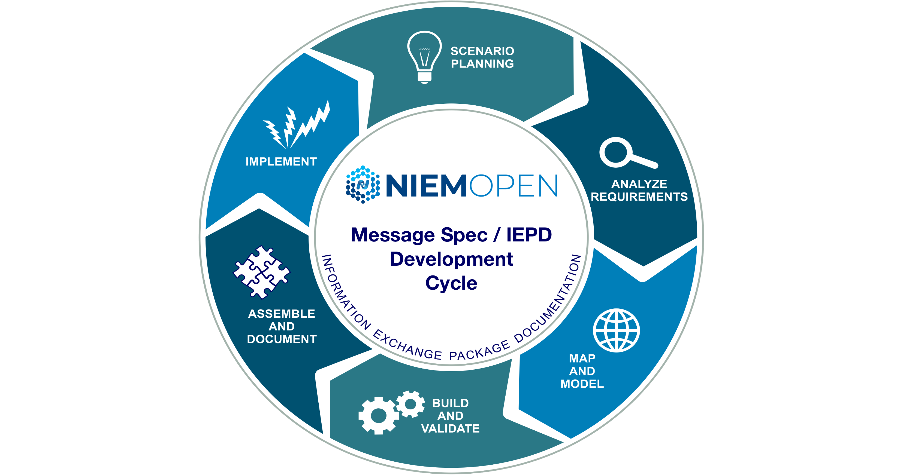
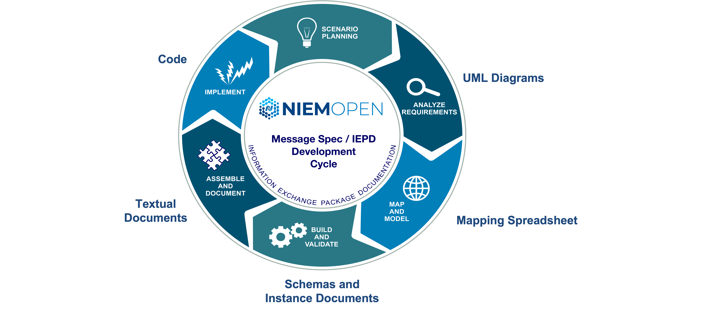
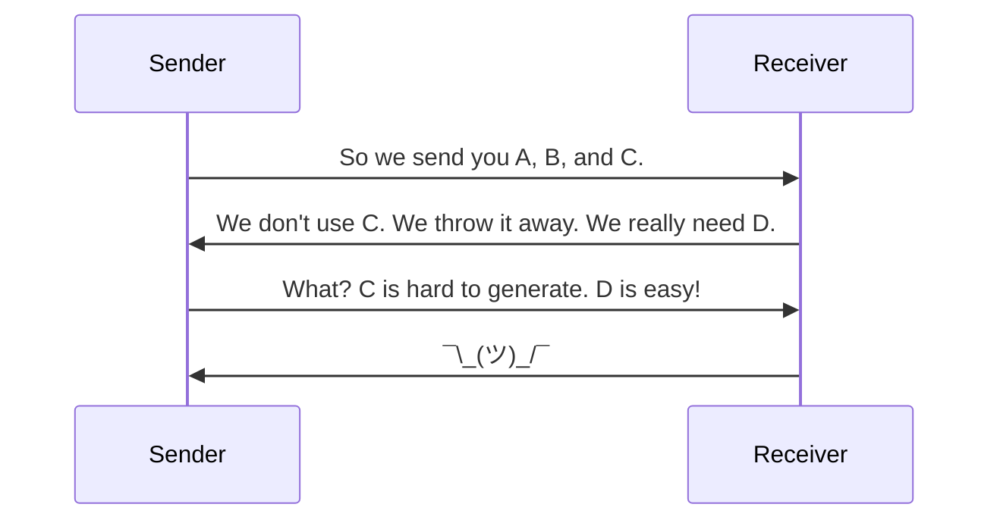

# Main NIEM Training Document
NIEM Training

Tom Carlson, GTRI
Thomas.Carlson@gtri.gatech.edu

# Introduction

## Purpose

A technical webinar focused on developers and implementers who are interested in a deep-dive of the National Information Exchange Model.

## Supporting Documents

All materials are available on the NIEM Training Github repo at [https://github.com/NIEM/NIEM-Training](https://github.com/NIEM/NIEM-Training). Specific materials used are listed on the README page and include:

- [**Master NIEM Training Document**](https://github.com/NIEM/NIEM-Training/blob/main/Master%20NIEM%20Training%20Document.md)
- [Mapping Spreadsheets](https://github.com/NIEM/NIEM-Training/tree/main/Mapping_Spreadsheets)
- [Ersatz Textual Instances](https://github.com/NIEM/NIEM-Training/tree/main/Text_Document)

## Sample Message Specification

- [Crash Driver Message Specification](https://github.com/NIEM/NIEM-Training/tree/main/Crash%20Driver%20IEPD)

## Agenda

- Logistics
- Introduction to NIEM
- Introduction to Message Spec / IEPD Development
	- Scenario Planning
	- Requirements Analysis
	- Mapping
		- Intro to Mapping
			- Mapping to Existing Objects
		- Creating New Objects
		- External Standards
	- Creating and Validating Schemas
	- Assembly
	- Publishing
	- Implementation
- Exercises
- Resources
___
## Logistics and Background

- Major revamp of prior training programs
- Three days, 1-5pm each day
- Short breaks on the hour
- Ask questions via chat _when you have them_
	- Someone is monitoring chat and will interrupt me as needed
- This document and supporting materials are at:
	- https://github.com/niem/niem-training
## Introduction to NIEM

- What is NIEM?
- The Scope of NIEM
- NIEM Harmonization and Organization
___
### What is NIEM? - Framework
- NIEM is a community-driven, government and jurisdiction-wide, standards-based approach to exchanging information
- Diverse communities can collectively leverage NIEM to increase efficiencies and improve decision-making
- NIEM is available to everyone, including public and private organizations
- NIEM includes a data model, governance, training, tools, technical support services, and an active community to assist users in adopting a standards-based approach to exchanging data


___
### What is NIEM? – Interop Problem
- If we don’t understand what each other means, we won’t be able to exchange info
- Need a common language for defining things


___
### What is NIEM? And what not?
**NIEM is:**
- a common vocabulary
- a means of enabling efficient information exchange across diverse public and private organizations

**NIEM is not:**
- a system or database
- a means of specifying how to transmit or store data
___
### What is NIEM? – Exchanging Data and Components
- Using NIEM, organizations come together to agree on a common vocabulary
- When additional organizations are added to the information exchange, the initial NIEM exchange can be reused, saving time and money


___
### What is NIEM? – Simplified Exchanges
- When using NIEM, you only need to “speak” two languages: your own and NIEM

| Without NIEM | With NIEM |
| --- | --- |
|||
___
### Scope of NIEM
- NIEM is a data layer standard and intentionally does not address all the necessary technologies needed for information sharing
- Exchange partners decide how to store and process the NIEM-conformant data being exchanged


___
### Scope of NIEM - Open Source Interconnection (OSI) model

**Detailed:**


**Simplified:**


___
### Bottle of Liquid
**A bottle of liquid:**

|  |  |
| --- | --- |
| Has some combination of liquids inside | NIEM is the liquid inside, the payload document |
| Has a shape | NIEM doesn’t care about the shape |
| Made of certain materials | NIEM doesn’t care about what the bottle is made out of or how it's constructed |
| Can be opaque or transparent | NIEM doesn’t care about whether you can see into the bottle |
| Is moved around by various means | NIEM doesn’t care about how you move the bottle around |
| Can be filled and emptied | NIEM doesn’t care about how you filled it or what you do with the liquid later |

___
### NIEM Harmonization and Organization

- Think of the NIEM data model as a mature and stable data dictionary of agreed-upon terms, definitions, relationships, and formats independent of how information is stored in individual agency systems
- The data model consists of two sets of closely related vocabularies:
	- NIEM core
	- Individual NIEM domains
- NIEM core includes data elements commonly agreed upon across all NIEM domains (i.e., person, activity, location, and item, etc.)
- Individual NIEM domains contain mission-specific data components that build upon NIEM core concepts


| Existing Domains                              | Upcoming Domains             |
| --------------------------------------------- | ---------------------------- |
| Agriculture                                   | Learning and Development     |
| Biometrics                                    | International Human Services |
| Chemical, Biological, Radiological, & Nuclear |                              |
| Cyber (new in 5.1)                            |                              |
| Emergency Management                          |                              |
| Human Services                                |                              |
| Immigration                                   |                              |
| Infrastructure Protection                     |                              |
| Intelligence                                  |                              |
| International Trade                           |                              |
| Justice                                       |                              |
| Maritime                                      |                              |
| Military Operations                           |                              |
| Screening                                     |                              |
| Surface Transportation                        |                              |

**Domains hold objects specific to their domains:**

| Agriculture | Biometrics |
| --- | --- |
|  |  |

| Chemical, Biological, Radiological, & Nuclear | Emergency Management |
| --- | --- |
|  |  |

| Human Services | Immigration |
| --- | --- |
|  |  |

| Infrastructure Protection | Intelligence |
| --- | --- |
|  |  |

| International Trade | Justice |
| --- | --- |
|  |  |

| Maritime | Military Operations |
| --- | --- |
|  |  |

| Screening  | Surface Transportation |
| --- | --- |
|  |  |


**NIEM Versioning**

- NIEM has major and minor versions, plus domain updates
- Major version releases, e.g. 4.2 to 5.0
	- Every 3 years
	- All bets are off
	- NIEM-Core can and will change
		- Underlying infrastructure can also change
	- Domains can change
	- Domains are harmonized
		- Combination of tools and human collaboration to reach consensus
		- Repeated content is collapsed
		- Misplaced content is moved, either to other domains or to core
		- New content is added
	- _Nothing_ in a major version change is guaranteed to be backwards compatible with earlier major releases
	- NIEM 6.0 scheduled for end of 2023
- Minor version releases, e.g. 5.0 to 5.1:
	- Annually
	- **NIEM-Core does not change!**
		- **Neither does the underlying infrastructure**
	- Domains can change
	- Domains can be harmonized
	- Domains can be added, like Cyber in 5.1
	- Domains are not guaranteed to be backwards compatible with earlier minor releases
		- But they often are
	- NIEM 5.2 scheduled for end of 2022
- Domain updates are done per-domain
	- Domains can update their content in between minor releases
	- Those updates then are normally folded into the next minor release
- Older versions never go away
	- You can still use NIEM 1.0 (but shouldn't)
	- There are plenty of NIEM 2.0 exchanges in current use
- Migration
	- Don't have to migrate
	- May want to migrate if a newer version gives you functionality you need (and you're already making changes)
	- NIEM provides tools for migrating the NIEM objects, ~90% effective
	- Manual work is needed for things you've added for your exchange

**NIEM Administration and Organization**


**Move to OASIS**

The NIEM program is transitioning from being a solely government-funded project to an open source project under [OASIS Open](https://www.oasis-open.org). So here's a quick plug for OASIS Open...

**About OASIS Open**

One of the most respected, nonprofit open source and open standards bodies in the world, OASIS Open advances the fair, transparent development of open source software and standards through the power of global collaboration and community.

**Why Should My Organization Join the NIEM OASIS Open Project?**

- Participate in the development of internationally recognized NIEM standards, ensuring your perspectives and use-cases are represented
- Unify fragmented efforts and encourage convergence
- Facilitate communication between private and public-sector
- Create partnerships and tap into brain trust of NIEM experts from the public sector
- Opportunity to become a steward with a seat on the NIEM Board
- Determine if/when approved work should be submitted to ITU, ICC, UN, ISO, etc.

**Get Involved!**

For more information about supporting the NIEM OASIS Open Project, contact TBD, TBD@oasis-open.org
# Message Spec / IEPD Overview
- "Information Exchange Package Documentation"
- Slowly changing to "Message Specification"
- Defines an exchange
- Made up of a bunch of documents, "artifacts"
	- Some meant for humans
	- Some meant for computers
___
## Message Spec Process
Creating a Message Spec is a multi-step process:

1. Scenario Planning
2. Analyze Requirements
3. Map and Model
4. Build and Validate
5. Assemble and Document (and Publish) 
6. Implement



Each step produces artifacts used by subsequent steps:

1. A clue as to what you're doing...
2. UML Diagrams
3. Mapping Spreadsheet
4. Schemas and Instance Documents
5. Textual Documents
6. Code



**Message Spec / IEPD Process – Idealized**


**Message Spec / IEPD Process – Real Life**


___
### Message Spec / IEPD Artifacts - Documentation

- Master Documentation (Word)
- Message Spec / IEPD catalog document (`iepd-catalog.xml`)
- Change log (text)
- README (text)
- Conformance assertion (text)
- Mapping Spreadsheet

___
### Message Spec / IEPD Artifacts - Definitional

- Wantlist (`wantlist.xml`)
- Schema subset schemas
- Extension schemas
- Exchange schemas
- Sample instances
- XML catalogs
___
## Scenario Planning

- Decide what the exchange is about
- Who are the exchange partners?
- Who are stakeholders?
- Communication is key



- Existing exchanges or other documentation can help
	- Within your organization
	- From NIEM repositories (_huge caveat_)
	- There's a community to draw from


___
### Existing Documentation

- Current technical architecture documents of all exchange partners
- Stakeholders that will be involved in the exchange
- Security, privacy, and other policy-related concerns associated with the exchange
- Technical characteristics of the exchange:
	- Types of data being shared
	- Number of data objects
		- Current structure of the data (logical, physical)
		- Use of external standards
___
## Analyze Requirements
- Diagrams
	- Use Case Diagrams
	- Business Process Diagrams
	- Sequence Diagrams
- Class Diagrams
- Spreadsheets
- Other documents

**Use Case Diagrams**


**Business Process Diagrams**


**Sequence Diagrams**


___
### UML Class Diagrams

- The bread and butter of Message Spec / IEPD business requirements
- Can be oriented towards business terms and objects
	- Better for consensus
- Can be oriented towards NIEM terms and objects
	- Pre-loads the mapping step
___
### Business Oriented Class Diagram

Representing objects in UML by their business names and relationships.


This vary depending on how your subject matter experts view objects and their relationships. For example, the charge to person relationship could be charge to the driver instead. Cardinality, which we will touch on later, could vary depending on the needs of the exchange. The important thing is reflecting how your business folks understand the data, not model purity.
___
### NIEM Oriented Class Diagram


___
### UML Tools
- [ArgoUML](https://en.wikipedia.org/wiki/ArgoUML)
- [BOUML](https://en.wikipedia.org/wiki/BOUML)
- [MagicDraw](https://en.wikipedia.org/wiki/MagicDraw) / [Rational Rose](https://en.wikipedia.org/wiki/IBM_Rational_Rose_XDE) (\$\$\$)
- [Visio](https://en.wikipedia.org/wiki/Microsoft_Visio) / [OmniGraffle](https://en.wikipedia.org/wiki/OmniGraffle)
- [Graphviz](https://graphviz.org/) / [Mermaid](https://mermaid-js.github.io/mermaid/) / [PlantUML](https://plantuml.com/)
- Many more…
___
### Business Rules
- Some rules are _not_ easily represented in UML
- You can use whatever works for your needs
- Schematron for XML
	- e.g. Birth dates must be in the past, salutations matching gender
- Plain old textual descriptions are great!
___

### The Process from Here On…

We have choices on how to proceed:

- Step-by-step
	- Finish mapping entirely before starting schemas
- Concurrent
	- Building schemas and instances as you go
- We'll use something in-between
	- Build an ersatz matching instance document as we map ([Crash Driver Report Complete](/Text_Document/12_Crash_Driver_Report_Complete.md))
	- Sorta like YAML without data values
	- Save schemas for the end## XML Schema in a Nutshell

XML Schema defines what an XML document needs to look like. (JSON Schema does the same for JSON documents.)

For example, this bit of XML Schema defines what a `PersonName` object needs to look like.

```xml
<xs:complexType name="PersonNameType">
	<xs:annotation>
		<xs:documentation>A data type for a combination of names and/or titles by which a person is known.</xs:documentation>
	</xs:annotation>
	<xs:sequence>
		<xs:element name="PersonGivenName" type="xs:string" minOccurs="1" maxOccurs="1"/>
		<xs:element name="PersonMiddleName" type="xs:string" minOccurs="0" maxOccurs="unbounded"/>
		<xs:element name="PersonSurName" type="xs:string" minOccurs="1" maxOccurs="1"/>
	</xs:sequence>
	<xs:attribute name="personNameCommentText" type="xs:string" use="optional"/>
</xs:complexType>

<xs:element name="PersonName" type="PersonNameType" nillable="true">
	<xs:annotation>
		<xs:documentation>A combination of names and/or titles by which a person is known.</xs:documentation>
	</xs:annotation>
</xs:element>

```
And here's what the matching XML _instance_ document might look like.

```xml
	<PersonName personNameCommentText="copied">
		<PersonGivenName>Peter</PersonGivenName>
		<PersonMiddleName>Bredon</PersonMiddleName>
		<PersonMiddleName>Death</PersonMiddleName>
		<PersonSurName>Wimsey</PersonSurName>
	</PersonName>
```

We will see much more of this. This is just an initial glance at it.
___
___
Generated on: 
Tue Mar 25 18:20:10 UTC 2025
