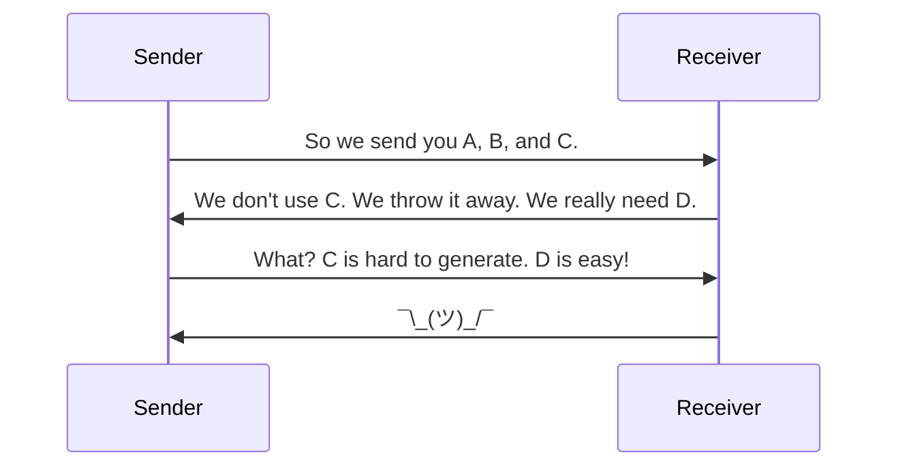

## Scenario Planning

- Decide what the exchange is about
- Who are the exchange partners?
- Who are stakeholders?
- Communication is key

- Existing exchanges or other documentation can help
	- Within your organization
	- From NIEM repositories (_huge caveat_)
	- There's a community to draw from

___
### Existing Documentation

- Current technical architecture documents of all exchange partners
- Stakeholders that will be involved in the exchange
- Security, privacy, and other policy-related concerns associated with the exchange
- Technical characteristics of the exchange:
	- Types of data being shared
	- Number of data objects
		- Current structure of the data (logical, physical)
		- Use of external standards
___
Remove this later!
