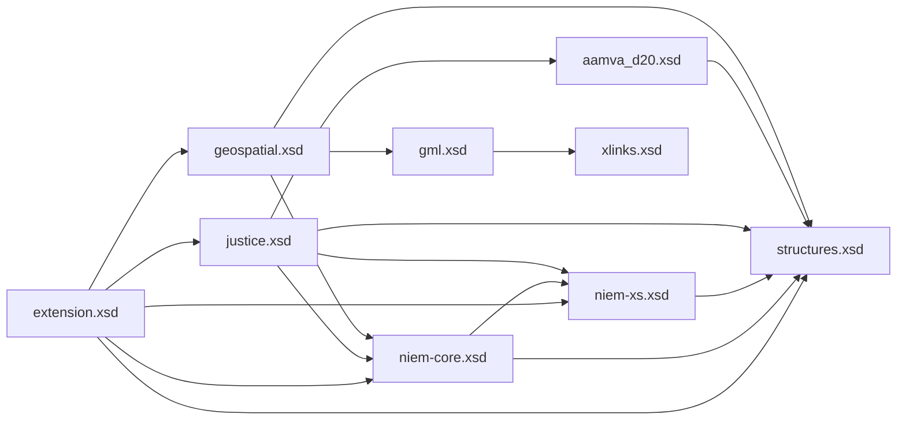

# Build and Validate

- Conformance
- Subsets
- Extension Schemas
- How things fit together

## NIEM Conformance

- Follow the rules in the [Naming and Design Rules (NDR)](http://niem.github.io/reference/specifications/ndr/) (NIEM 5)
	- Available in draft form for NIEM 6 on [Github](https://github.com/niemopen/niem-naming-design-rules/blob/dev/ndr6src.md)
- Follow the rules in the [IEPD Spec](http://niem.github.io/reference/specifications/iepd/) (NIEM 5)
	- Coming eventually for NIEM 6
- Many NDR rules exist as Schematron for XML
	- Can check these via the Conformance Testing Assistant (ConTesA) for NIEM 5
	- Can run the Schematron directly oXygen, with a plug-in in XMLSpy
		- See below
	- NIEM Toolbox will provide this functionality for NIEM 6 soon

## Schema Subsets

- NIEM has ~13,000 elements
- You don’t want them all
- NIEM supports mini versions of NIEM
	- With the elements / types you want
	- Plus things needed to make the elements / types you want work
- Use the [SSGT](https://tools.niem.gov/niemtools/ssgt/index.iepd) for this for NIEM 5
	- NIEM Toolbox will provide this functionality for NIEM 6 soon

## Extension Schema(s)

- Create new elements for your exchange
- Defines the root element of the exchange
- Emulate how NIEM does it, both in XML and in JSON
- Utilize Augmentations to add your new objects to existing NIEM objects in XML
	- Concrete extension is an alternative
	- Can directly modify NIEM objects in JSON in order to match XML instances
- Can have multiple extension schemas in XML
- Some folks put code tables into a separate extension schema in XML

## How Schemas Fit Together

### XML Schemas

In an XML context, NIEM is broken into domains, with one schema file per domain. This aids in governance as XML Schema is one of the canonical definitional formats for NIEM, so individual schema-based domains can be updated independently. It does make for a complicated diagram:

### JSON Schemas

JSON Schema is not one of the canonical definitional formats for NIEM. NIEM isn't maintained in a JSON Schema format. When you create a subset using JSON Schema, or convert XML or CMF to JSON Schema, everything will be in one schema file to which you can modify to add your extensions.

## Help with Schemas

- Use a good validating XML/JSON editor with schema support
	- XMLSpy
		- Windows
	- oXygen
		- Windows, macOS, Linux
- Declare a conformance target for XML
	- Just use the same one I am
- Declare and import all schemas used for XML
	- Watch out for schemas incorporated only via substitution groups
	- Group heads don’t know who the members are
	- Still need to declare and import those

## Example Instances

- Required
- Validating against your schemas ensures your intent
- Some editors can create them from schemas, but
	- You’ll always need to tweak those
- Other tools are out there…

## Tips and Tricks for XML

- Christina’s [oXygen Snippets](https://niem.github.io/reference/tools/oxygen/snippets/)
	- oXygen only
- Use [Schematron](https://niem.github.io/reference/tools/oxygen/ndr/) to check your work as you go
	- oXygen
	- XMLSpy with plug-in
- [MEP Builder](https://sourceforge.net/projects/niem-mep-builder/)
	- Work on mapping spreadsheets
	- Generate subsets

___
